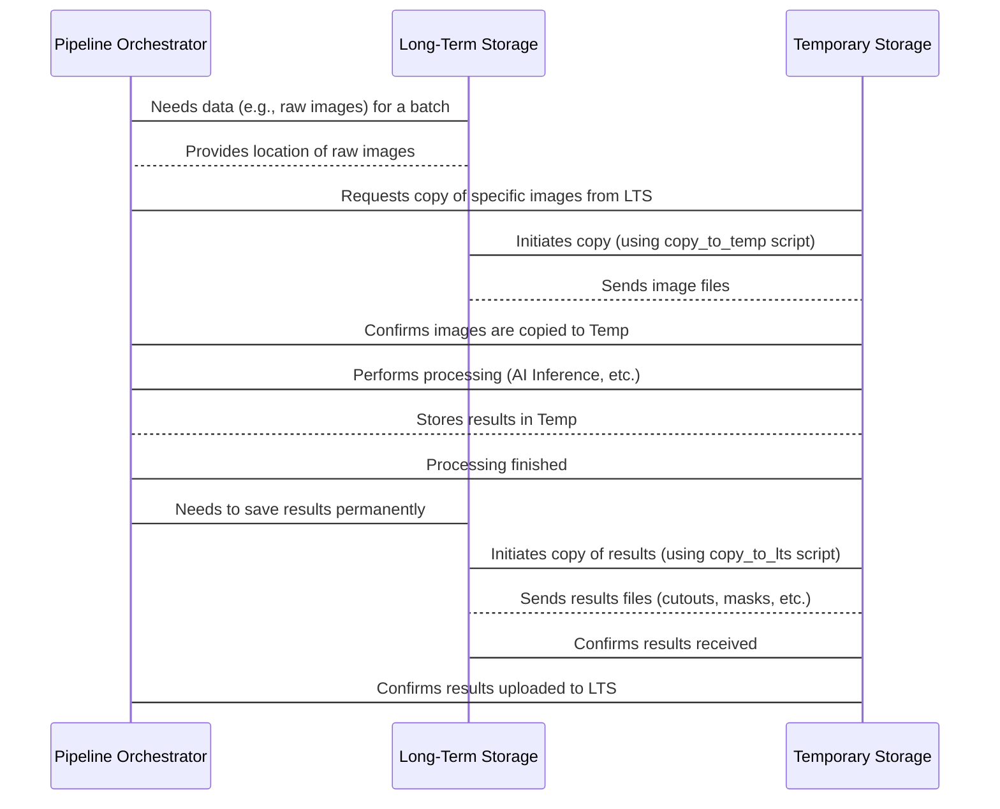

# Chapter 1: Long-Term Storage (LTS)

Welcome to the tutorial for the `Field-AnnotationPipeline` project! This pipeline helps process images from agricultural fields. Before we dive into the steps of processing, we need to understand where all our important project data lives.

Think of any big project – you need a place to keep *everything*. Raw materials, finished products, notes, instructions... everything! For our image processing pipeline, this central storage place is called **Long-Term Storage**, or **LTS** for short.

## What is Long-Term Storage (LTS)?

Imagine LTS as the project's main library or archive. It's a permanent, shared location where we keep all the crucial assets related to our field image processing. This includes:

*   **Raw Images:** The original pictures taken in the field.
*   **Processed Data:** Results like cutouts of individual plants, masks showing plant shapes, and annotations.
*   **Metadata Tables:** Information *about* the images and data (like what plant species is in the image, when it was taken, etc.). We'll learn more about this in the next chapter, [Image Metadata](02_image_metadata_.md).
*   **Trained AI Models:** The "brains" of the pipeline that detect or classify plants.

Why do we need a central LTS? Because the pipeline runs on different computers (maybe your local machine, maybe a powerful server). These processing computers might not have enough space to store *all* the data forever. Also, having one central place makes it easy for everyone working on the project to access the same data.

## How the Pipeline Uses LTS

The pipeline's interaction with LTS is quite simple:

1.  **Get Data:** When the pipeline needs to process a batch of images, it copies the necessary files (like the raw images and their metadata) *from* LTS to a smaller, temporary work area on the computer where the processing will happen.
2.  **Process Data:** All the steps of the pipeline ([AI Inference Tasks](07_ai_inference_tasks_.md), etc.) happen in this temporary work area.
3.  **Store Results:** Once processing is finished, the final results (the processed data) are copied *back to* LTS for permanent storage.

Think of it like borrowing books from a library (LTS) to work on them at your desk (temporary storage), and then returning your notes and finished work (processed data) back to the library for safekeeping.

## Where is LTS Defined?

The location of the Long-Term Storage is specified in the project's configuration files. Let's look at a snippet from the default configuration file (`conf/paths/default.yaml`):

```yaml
# longterm storage for field images
longterm_storage: /mnt/research-projects/r/raatwell/longterm_images3/
longterm_images2: /mnt/research-projects/s/screberg/longterm_images2/
# delete this
inference_results_dir: ${paths.datadir}/inference_results
```

In this snippet, the line `longterm_storage: /mnt/research-projects/r/raatwell/longterm_images3/` tells the pipeline where to find the main LTS directory. The path `/mnt/research-projects/...` is just an example; the actual path will depend on where LTS is set up for your project.

## Getting Data *From* LTS

Before the pipeline can process anything, it needs the raw images. A dedicated script handles copying these images (and sometimes other files) from LTS to the [Temporary Storage](05_temporary_storage_.md) location.

Let's look at a very simplified version of the code that does this, found in `src/copy_to_temp.py`:

```python
import logging
import shutil
from pathlib import Path

log = logging.getLogger(__name__)

class BatchDownloader:
    def __init__(self, cfg, batch_id: str):
        # Get the LTS path from config
        self.src_longterm_developed = Path(cfg.paths.longterm_storage, "field-batches", self.batch_id, "developed-images")
        # Get the temporary destination path from config
        self.dst_temp_developed = Path(cfg.paths.temp_dir, self.batch_id, "developed-images")
        log.debug(f"LTS source: {self.src_longterm_developed}")
        log.debug(f"Temp destination: {self.dst_temp_developed}")

    def download_image(self, src: Path, dest: Path):
        # Use shutil.copy2 to copy the file
        shutil.copy2(src, dest)
        log.debug(f"Copied {src} to {dest}")

    def download_batch(self):
        # ... (code to find images to copy) ...
        # Ensure the destination folder exists
        self.dst_temp_developed.mkdir(parents=True, exist_ok=True)
        # Loop through images and copy them
        for file in images_to_copy: # Simplified loop
             self.download_image(file, self.dst_temp_developed / file.name)

```

**Explanation:**

*   The `__init__` method reads the LTS path (`cfg.paths.longterm_storage`) and the temporary path (`cfg.paths.temp_dir`) from the configuration. It then builds the specific source and destination paths for the images being processed in this particular "batch" (a group of images).
*   The `download_image` method is the core function that performs the actual copying using `shutil.copy2`, a standard Python function for copying files.
*   The `download_batch` method (simplified here) finds which images need copying and then calls `download_image` for each one, making sure the destination folder exists first.

When this script runs, it effectively "borrows" the raw images from the LTS library and places them on the "desk" (temporary storage) for processing.

## Putting Data *Into* LTS

Once the pipeline has finished processing, the results (like cutouts, masks, and inspection images) are generated in the [Temporary Storage](05_temporary_storage_.md). The final step is to archive these results permanently in LTS.

This is handled by another script, typically `src/copy_to_lts.py`. Here's a simplified view:

```python
import logging
import shutil
from pathlib import Path

log = logging.getLogger(__name__)

class Batch2LTS:
    def __init__(self, cfg, batch_id: str):
        # Get the temporary source path from config
        self.src_temp_cutouts = Path(cfg.paths.temp_dir) / self.batch_id / "cutouts"
        # Get the LTS destination path from config
        self.dst_longterm_cutouts = Path(cfg.paths.longterm_storage) / "field-batches" / self.batch_id / "cutouts"
        log.debug(f"Temp source: {self.src_temp_cutouts}")
        log.debug(f"LTS destination: {self.dst_longterm_cutouts}")

    def upload_file(self, src: Path, dest: Path):
        # Use shutil.copy2 to copy the file
        shutil.copy2(src, dest)
        log.debug(f"Copied {src} to {dest}")

    def upload_batch(self):
        # ... (code to find results files) ...
        # Ensure the destination folder exists in LTS
        self.dst_longterm_cutouts.mkdir(parents=True, exist_ok=True)
        # Loop through results files and copy them
        for file in result_files_to_copy: # Simplified loop
             self.upload_file(file, self.dst_longterm_cutouts / file.name)

```

**Explanation:**

*   The `__init__` method gets the temporary source path (`cfg.paths.temp_dir`) where the results are currently stored and the LTS destination path (`cfg.paths.longterm_storage`). It constructs the specific paths for the current batch.
*   The `upload_file` method is similar to `download_image`, using `shutil.copy2` to move the file.
*   The `upload_batch` method (simplified) identifies the result files (cutouts, masks, etc.) in the temporary location and then calls `upload_file` for each one, creating the necessary folders in LTS if they don't exist.

This process is like "returning the finished work" from your desk back to the LTS library for permanent archiving.

## The LTS Workflow

Putting it all together, the typical flow involving LTS looks like this:



This diagram shows that LTS is the source and destination for data, while the actual processing happens in the [Temporary Storage](05_temporary_storage_.md) area.

## Conclusion

Long-Term Storage (LTS) is the foundational element of the `Field-AnnotationPipeline`. It acts as the central, permanent home for all project assets, including raw images, processed data, metadata, and models. The pipeline efficiently manages data by copying necessary files from LTS to a temporary workspace for processing and then copying the results back to LTS for safekeeping.

Now that we understand where our data lives permanently, we need to know more *about* that data. In the next chapter, we will explore the concept of [Image Metadata](02_image_metadata_.md) and why it's so important for organizing and using our images effectively.

[Chapter 2: Image Metadata](02_image_metadata_.md)

---

Generated by [AI Codebase Knowledge Builder](https://github.com/The-Pocket/Tutorial-Codebase-Knowledge)