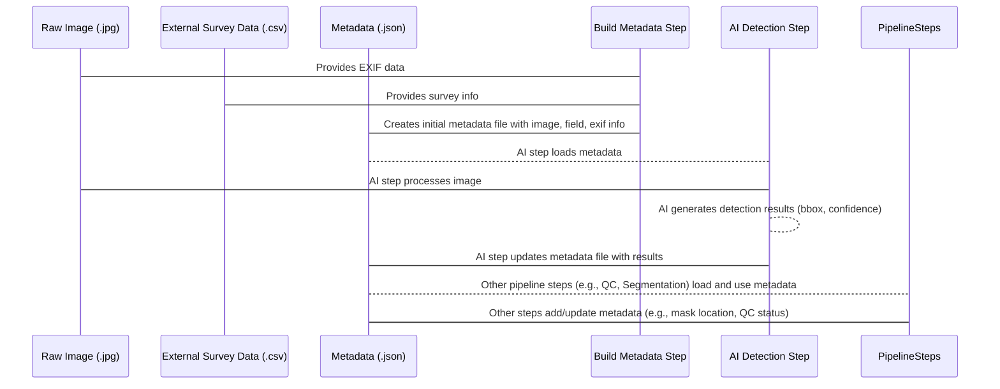

# Chapter 2: Image Metadata

Welcome back to the tutorial for the `Field-AnnotationPipeline`! In [Chapter 1: Long-Term Storage (LTS)](01_long_term_storage__lts__.md), we learned that LTS is the central library where all our project's valuable files are kept safe. But storing just the raw images isn't enough. Imagine trying to find a specific book in a library with no catalog! You'd have millions of books, but no easy way to know what's inside, who wrote it, or where it is.

For our images, we need something similar – information *about* the images. This is where **Image Metadata** comes in.

## What is Image Metadata?

Think of Image Metadata as a detailed label or an ID card attached to each image and any pieces (like cutouts) we take from it. It's structured information that tells us a lot about the image:

*   **Where and when was it taken?** (Capture date, time, location)
*   **What camera or app was used?** (Camera make/model, settings)
*   **What plant species are we interested in in this image?** (The target plant's species)
*   **Where exactly is that plant in the image?** (Bounding box coordinates, segmentation mask)
*   **How sure are the AI models about their predictions?** (Confidence scores)
*   **Are there any special notes?** (e.g., "cloudy day," "more than one plant detected")

This metadata isn't just created once and forgotten. It's **built, updated, and used** throughout the different steps of the pipeline. It's like tracking the image's entire journey and adding notes at each stop.

## Why is Metadata So Important?

Why do we need all this extra information?

1.  **Organization and Search:** It allows us to easily find specific images. Want to see all images taken on a sunny day in Texas during May 2024 where the AI detected a 'Palmer Amaranth' weed? Metadata makes this query possible.
2.  **Pipeline Communication:** Different steps in the pipeline need to know things about the image. The AI step adds bounding boxes *to the metadata*. The Quality Inspection step *reads the bounding box from the metadata* to show you where the AI looked.
3.  **Tracking Progress:** The metadata can track which steps an image has gone through and what results were generated.
4.  **Data Analysis:** Researchers can use the combined metadata from many images to analyze trends, like how plant growth changes over time or how detection accuracy varies with lighting conditions.

Without metadata, our pipeline would be just processing blind images. With it, we build a rich dataset that is searchable, trackable, and valuable for analysis.

## Where Does Metadata Come From?

Image metadata in this pipeline comes from several places:

1.  **Initial Capture:** Some basic information (like camera, date, time, location if available) might be embedded directly in the image file itself (called EXIF data) or recorded by the survey app used in the field.
2.  **External Data:** Information recorded separately during the field survey (like plant species, growth stage, field conditions) is often stored in tables (like CSV files). This external data is merged with the image information.
3.  **Pipeline Steps:** As the image moves through the pipeline, each relevant step adds its results to the metadata. This is where AI predictions, generated cutouts, masks, and quality control notes are added.

Let's look at how the pipeline handles this.

## Building the Initial Metadata

One of the first things the pipeline does after getting images from LTS is to build the initial metadata file for each image. This involves:

*   Extracting basic info from the image itself (EXIF data).
*   Looking up related information from external survey data tables based on the image name.
*   Combining this into a structured format, usually a JSON file.

A script like `src/build_metadata.py` handles this. Here's a simplified idea of what it does:

```python
# Simplified snippet from src/build_metadata.py

class MetadataExtractor:
    def __init__(self, cfg):
        # Load external survey data from a CSV file
        self.df = pd.read_csv(cfg.paths.merged_tables_permanent)
        # Load species info lookup table
        with open(cfg.paths.field_species_info, "r") as f:
             self.species_info = json.load(f)
        # ... other setup ...

    def get_exif_data(self, image_path: str) -> Dict:
        # Reads EXIF data from the image file
        # (Code using exifread library)
        # Returns a dictionary of relevant EXIF tags
        pass # Simplified

    def get_plant_field_info(self, image_info_from_csv: pd.DataFrame) -> Dict:
        # Extracts field notes (species, growth stage, etc.) from the loaded CSV data
        # Returns a dictionary
        pass # Simplified

    def get_category(self, image_name: str) -> Dict:
        # Uses the species info lookup table and image name to find class ID, etc.
        # Returns a dictionary
        pass # Simplified

    def save_image_metadata(self, image_path: Path, image_info, annotations, plant_field_info, category, exif_data):
        # Combines all collected info into a single dictionary
        combined_dict = {
            "image_info": image_info,
            "plant_field_info": plant_field_info,
            "annotation": annotations, # Initially empty, will be filled later
            "category": category,
            "exif_meta": exif_data,
            "version": "..."
        }
        # Saves the dictionary to a JSON file next to the image
        metadata_filename = image_path.parent.parent / "cutouts" / f"{image_path.stem}_0.json"
        with open(metadata_filename, "w") as file:
            json.dump(combined_dict, file, indent=4, default=str)
        log.debug(f"Metadata saved for {metadata_filename.name}.")

```

**Explanation:**

*   The `__init__` method loads external data sources like the survey CSV and a species lookup table.
*   Methods like `get_exif_data`, `get_plant_field_info`, and `get_category` extract different pieces of information from the image file and the loaded external data.
*   The `save_image_metadata` method puts all these pieces together into a single Python dictionary and then saves it as a JSON file. Notice that the `"annotation"` section is included but is initially empty; this is where AI results will go later.

After this step, each image has a corresponding `.json` file containing its basic information. You can see the structure of these JSON files in the `docs/DATA_STRUCTURE_TEMPLATE.md` file.

## Updating Metadata During the Pipeline

As the image moves through pipeline tasks, like [AI Inference Tasks](07_ai_inference_tasks_.md), these tasks read the existing metadata, perform their work, and then add or modify the metadata to record their results.

Let's look at the weed detection step as an example (simplified from `src/detect_weeds.py`):

```python
# Simplified snippet from src/detect_weeds.py

class ProcessDetections:
    def __init__(self, cfg: DictConfig):
        # Setup the AI model
        self.weed_detector = WeedDetector(cfg.paths.yolo_weed_detection_model)
        # ... other setup ...

    def load_metadata(self, metadata_path: Path) -> Dict:
        # Reads the JSON file into a Python dictionary
        with open(metadata_path, "r") as file:
            metadata = json.load(file)
        return metadata

    def update_metadata(self, metadata_path: Path, metadata: dict) -> None:
        # Saves the modified Python dictionary back to the JSON file
        with open(metadata_path, "w") as file:
            json.dump(metadata, file, indent=4, default=str)
        log.debug(f"Metadata saved to {metadata_path.name}.")

    def process_image_sequentially(self, image_path: Path) -> None:
        # Find the corresponding metadata file
        metadata_path = image_path.parent.parent / "cutouts" / f"{image_path.stem}_0.json"

        # 1. Load the existing metadata
        metadata = self.load_metadata(metadata_path)

        # 2. Run the AI detection
        detection_results = self.weed_detector.detect_weeds(image_path)

        # 3. Update the metadata dictionary with detection results
        metadata["annotation"]["bbox"] = detection_results.get("bbox", None)
        metadata["annotation"]["det_pred_conf"] = detection_results.get("det_pred_conf", None)
        # Add notes if detection was missing or multiple were found
        # metadata = self.update_notes(metadata) # Simplified away

        # 4. Save the updated metadata back to the file
        self.update_metadata(metadata_path, metadata)

    # ... process_images method loops through all images and calls process_image_sequentially ...
```

**Explanation:**

*   The `process_image_sequentially` function represents the core logic for processing one image.
*   It first `load_metadata` to get the current state of the image's information.
*   It then runs the AI model (`self.weed_detector.detect_weeds`).
*   Crucially, it then takes the results (the bounding box and confidence score) and adds them to the `metadata` dictionary, specifically within the `"annotation"` section.
*   Finally, it calls `update_metadata` to save the modified dictionary back into the same JSON file, overwriting the previous version.

This pattern (load, process, update dictionary, save) is common throughout the pipeline for tasks that generate new information about an image.

## Metadata's Journey Through the Pipeline

The metadata file travels logically with the image, being updated at each step. Here's a simplified view of the metadata flow:



This diagram shows how the metadata file starts with information from the image and external sources and is then enriched by subsequent pipeline steps like AI detection.

## Looking at the Metadata File

As mentioned, the metadata is stored in JSON files. You can view the detailed structure in `docs/DATA_STRUCTURE_TEMPLATE.md`. This document shows the different sections (`image_info`, `plant_field_info`, `annotation`, etc.) and what kind of data is stored in each field.

For example, the `annotation` section, which is populated by the AI detection step, might look something like this inside the JSON file after the AI has run:

```json
// Simplified snippet from a .json metadata file
{
    "image_info": {
        "Name": "IMG_20240101_123456",
        "Batch_id": "TX_2024-05-10",
        // ... other image info ...
    },
    "plant_field_info": {
        "Species": "Palmer Amaranth",
        "GrowthStage": "Seedling",
        // ... other field info ...
    },
    "annotation": {
        "bbox": [120, 340, 560, 780], // [x_min, y_min, x_max, y_max]
        "det_pred_conf": 0.95,      // Confidence score from detection
        "HasMatPred": null,         // Will be filled by segmentation step
        "HasMatPredConf": null      // Will be filled by segmentation step
    },
    "category": {
        "class_id": "weed_palmer_amaranth",
        "common_name": "Palmer Amaranth",
        // ... other category info ...
    },
    // ... other sections ...
    "version": "1.0"
}
```
This example shows how the `bbox` and `det_pred_conf` fields within the `annotation` section are populated by the AI detection process. Other steps, like segmentation, would fill in the `HasMatPred` and `HasMatPredConf` fields.

## Conclusion

Image Metadata is the central information hub for each image processed by the `Field-AnnotationPipeline`. It starts with basic capture and field data and is continuously updated with results from AI models and other pipeline tasks. This structured data makes the entire dataset searchable, allows different pipeline steps to communicate effectively, and provides rich information for downstream analysis.

Now that we understand what data we're processing and how its information is stored and updated, the next logical step is to understand how the pipeline knows *where* to find everything, what settings to use, and how to behave. This is all handled by the pipeline's [Configuration](03_configuration_.md).

[Chapter 3: Configuration](03_configuration_.md)

---

Generated by [AI Codebase Knowledge Builder](https://github.com/The-Pocket/Tutorial-Codebase-Knowledge)