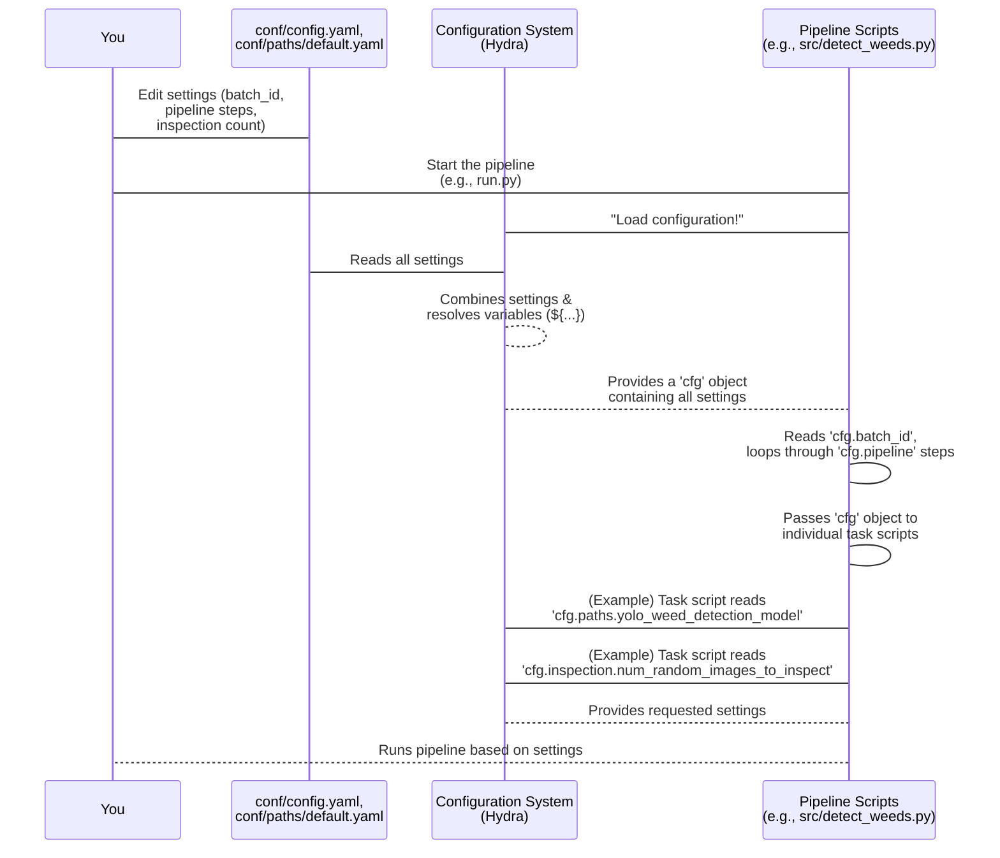

# Chapter 3: Configuration

Welcome back! In the last chapter, [Chapter 2: Image Metadata](02_image_metadata_.md), we learned that each image and its pieces have a detailed ID card called metadata, which tracks information about the image and its journey through the pipeline.

Now, imagine you have all your ingredients (the images and their initial metadata in [Long-Term Storage (LTS)](01_long_term_storage__lts__.md)) and you know *about* them (thanks to metadata). But how does the kitchen (the pipeline) know *what recipe to follow*? How does it know which batch of images to use, which steps to perform (like detecting weeds or inspecting results), where the ingredients are stored, and what settings to use for each step?

This is where **Configuration** comes in.

## What is Configuration?

Think of Configuration as the pipeline's detailed instruction manual or recipe book. It's a set of parameters and settings that tell the pipeline exactly what to do and how to do it for a specific run. Instead of hardcoding these instructions directly into the code (which would mean changing the code every time you want to run something slightly different), the pipeline reads its instructions from separate configuration files.

This makes the pipeline very flexible! You can easily tell it:

*   "Process batch `AL_2023-08-17`."
*   "This time, only run the weed detection and quality inspection steps."
*   "Use this specific AI model file."
*   "For the quality inspection step, only show me 50 random images."

All of these instructions are defined in the Configuration.

## Where is the Configuration Located?

The configuration for the `Field-AnnotationPipeline` is primarily managed using a system called Hydra. Hydra allows breaking down the configuration into smaller, organized files, usually located in a `conf/` directory at the root of the project.

The main configuration entry point is typically `conf/config.yaml`. Other configuration files are organized within the `conf/` directory, like `conf/paths/default.yaml` which specifically handles file and directory locations.

These files use a simple, human-readable format called **YAML**.

Let's look at some parts of these files (simplified):

**`conf/config.yaml` (Main settings)**

```yaml
# conf/config.yaml - Simplified
pipeline:
  # Uncomment steps you want to run
  # - find_unprocessed_batches
  # - sync_from_remote
  # - copy_to_temp
  - build_metadata
  # - classify_mat
  - detect_weeds
  # - unet_segment_weeds
  - inspection # Let's run quality inspection
  # - copy_to_lts
  # - cleanup
  # - manual_inspection

batch_id: AL_2023-08-17 # Specifies which batch to process

inspection:
  num_random_images_to_inspect: 50 # Parameter for the inspection step

# ... other settings ...
```

**`conf/paths/default.yaml` (File paths)**

```yaml
# conf/paths/default.yaml - Simplified
# directory paths
workdir: ${hydra:runtime.cwd} # Variable: project root
logdir: ${paths.workdir}/logging # Path relative to workdir
datadir: ${paths.workdir}/data
temp_dir: ${paths.datadir}/temp # Path relative to datadir

# model paths
yolo_weed_detection_model: ${paths.datadir}/field-tools/models/weed_detection/weights/best.pt

# longterm storage (from Chapter 1)
longterm_storage: /mnt/research-projects/r/raatwell/longterm_images3/

# ... other paths ...
```

## Solving a Use Case with Configuration

Let's use our example from earlier: "I want to run the pipeline on batch `AL_2023-08-17` and only run the `build_metadata`, `detect_weeds`, and `inspection` steps. For the inspection step, I only want to look at 50 random images."

Here's how you would configure this:

1.  **Specify the Batch:** Open `conf/config.yaml` and find the `batch_id` setting. Make sure it's set to the batch you want:

    ```yaml
    batch_id: AL_2023-08-17 # Set this to your desired batch
    ```

2.  **Specify the Steps:** Find the `pipeline` list in `conf/config.yaml`. This list determines which parts of the pipeline run. Lines starting with `#` are commented out (ignored). Uncomment the steps you want (`build_metadata`, `detect_weeds`, `inspection`) and comment out the others you *don't* want to run this time:

    ```yaml
    pipeline:
      # - find_unprocessed_batches # Commented out
      # - sync_from_remote       # Commented out
      # - copy_to_temp           # Commented out
      - build_metadata         # Uncommented
      # - classify_mat         # Commented out
      - detect_weeds           # Uncommented
      # - unet_segment_weeds   # Commented out
      - inspection             # Uncommented
      # - copy_to_lts          # Commented out
      # - cleanup              # Commented out
      # - manual_inspection    # Commented out
    ```
    The order of the uncommented steps in this list is important; it defines the sequence in which they will run.

3.  **Specify Parameters for a Step:** Find the section for the `inspection` step (it's indented under `inspection:`). Change the `num_random_images_to_inspect` setting:

    ```yaml
    inspection:
      num_random_images_to_inspect: 50 # Set this parameter
    ```

4.  **File Paths:** You generally don't need to change `conf/paths/default.yaml` unless you've moved your project data, models, or [Long-Term Storage (LTS)](01_long_term_storage__lts__.md) location. The pipeline will read these automatically to know where to find things like AI models (`yolo_weed_detection_model`) or the main data archive (`longterm_storage`). Notice how some paths use `${...}`. These are variables that the configuration system resolves. For example, `${paths.datadir}/field-tools/...` tells the pipeline to look inside the `data` directory (which is itself defined using `${paths.workdir}/data`) for the model file.

By making these simple edits to the `.yaml` files, you've completely changed the pipeline's behavior for this specific run without touching any of the core Python code.

## How the Pipeline Uses Configuration (Under the Hood)

When you start the pipeline (usually by running a command like `python src/run.py ...`), the first thing it does is load the configuration.

Here's a simplified look at what happens:

1.  **Loading:** The configuration system reads `conf/config.yaml` and any other configuration files it's told to use (like `conf/paths/default.yaml`, because `config.yaml` includes `paths: default` at the top).
2.  **Combining:** It combines all the settings from these files into one big structure.
3.  **Resolving Variables:** It figures out the values for any variables like `${paths.workdir}` or `${paths.datadir}`.
4.  **Creating the Config Object:** It creates a special object (often called `cfg` in the code) that holds all the final, resolved settings in an easy-to-access format.

This `cfg` object is then passed to different parts of the pipeline. Any script or module that needs to know a setting (like the `batch_id`, the path to a model, or how many images to inspect) gets it from this `cfg` object.



In the code, accessing a setting is very straightforward. If a script needs to know the `batch_id`, and it has received the `cfg` object, it simply uses `cfg.batch_id`. If it needs the path to the weed detection model, it uses `cfg.paths.yolo_weed_detection_model`.

Here's a simple example showing how a script might access settings (from `src/copy_to_temp.py` which we saw in [Chapter 1](01_long_term_storage__lts__.md)):

```python
# Simplified from src/copy_to_temp.py
import logging
from pathlib import Path

log = logging.getLogger(__name__)

class BatchDownloader:
    # The 'cfg' object is passed into the constructor
    def __init__(self, cfg, batch_id: str):
        # Accessing settings from the cfg object:
        lts_path = Path(cfg.paths.longterm_storage)
        temp_path = Path(cfg.paths.temp_dir)

        # Using the settings
        self.src_longterm_developed = lts_path / "field-batches" / batch_id / "developed-images"
        self.dst_temp_developed = temp_path / batch_id / "developed-images"

        log.debug(f"LTS source: {self.src_longterm_developed}")
        log.debug(f"Temp destination: {self.dst_temp_developed}")

    # ... download methods follow ...
```

**Explanation:**

*   The `BatchDownloader` class receives the `cfg` object and the specific `batch_id` it needs to work on.
*   Inside the `__init__` method, it accesses the `longterm_storage` path using `cfg.paths.longterm_storage` and the temporary directory path using `cfg.paths.temp_dir`.
*   It then uses these paths, combined with the `batch_id`, to build the full source and destination paths for the files it needs to copy.

This pattern of reading settings from the `cfg` object is used throughout the pipeline code, making the code itself independent of the specific parameters being used for a run.

## Conclusion

Configuration is the pipeline's instruction set. Stored in easy-to-edit YAML files like `conf/config.yaml` and `conf/paths/default.yaml`, it defines everything from which batch to process and which steps to run, to where files and models are located, and specific parameters for each task. By modifying these files, you can customize the pipeline's behavior for different tasks and datasets without changing the core code. The pipeline loads this configuration into a single `cfg` object that its scripts use to get all the necessary information.

Now that we understand where data lives ([LTS](01_long_term_storage__lts__.md)), what information we track about it ([Metadata](02_image_metadata_.md)), and how we instruct the pipeline what to do ([Configuration](03_configuration_.md)), the next step is to see how all these pieces are put together and run in the correct order. This is the job of the [Pipeline Orchestrator](04_pipeline_orchestrator_.md).

[Chapter 4: Pipeline Orchestrator](04_pipeline_orchestrator_.md)

---

Generated by [AI Codebase Knowledge Builder](https://github.com/The-Pocket/Tutorial-Codebase-Knowledge)