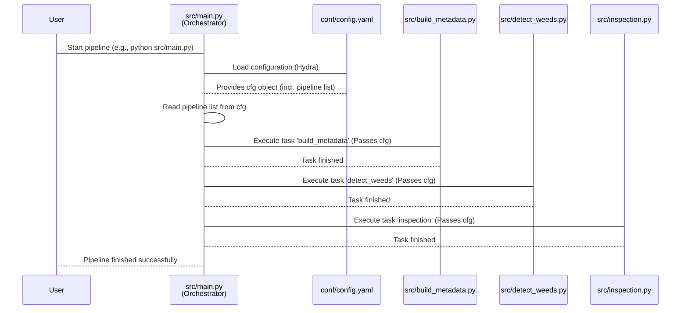

# Chapter 4: Pipeline Orchestrator

Welcome back! In our journey through the `Field-AnnotationPipeline`, we've learned about the **Long-Term Storage (LTS)** ([Chapter 1](01_long_term_storage__lts__.md)) where all our project data lives permanently. We've also seen how **Image Metadata** ([Chapter 2](02_image_metadata_.md)) acts as an ID card for each image, tracking its information and progress. Most recently, we explored **Configuration** ([Chapter 3](03_configuration_.md)), which is like the pipeline's recipe book, telling it *what* to do and with *what* settings.

Now, imagine you have the best ingredients (data in LTS, tracked by Metadata) and a perfect recipe book (Configuration). Who actually reads the recipe, gathers the ingredients (from LTS via processes like those in Chapter 1), performs each step in the right order, and makes sure nothing goes wrong?

This is the job of the **Pipeline Orchestrator**.

## What is the Pipeline Orchestrator?

Think of the Pipeline Orchestrator as the central "brain" or the project manager of the entire operation. Its main responsibility is to:

1.  **Read the Plan:** Look at the **Configuration** ([Chapter 3](03_configuration_.md)) to understand exactly which steps need to be performed for a specific batch of images.
2.  **Execute Steps:** Go through the list of required steps one by one, starting each task (like building metadata, detecting weeds, running inspection, etc.).
3.  **Pass Instructions:** Make sure each step gets the necessary information, particularly the overall configuration settings.
4.  **Handle Issues:** Monitor the steps and stop the entire process if a step fails or encounters an error.

It's the conductor of the orchestra, making sure each musician (each pipeline task) plays their part at the right time and in the right sequence, all according to the sheet music (the configuration).

## Our Use Case Revisited

Let's go back to the example from [Chapter 3: Configuration](03_configuration_.md) where we configured the pipeline to:

*   Process batch `AL_2023-08-17`.
*   Run only the `build_metadata`, `detect_weeds`, and `inspection` steps.
*   Use 50 random images for the inspection step.

We set this up in `conf/config.yaml`. The Pipeline Orchestrator is the part of the code that *reads* that `conf/config.yaml` file and then actively *starts* the `build_metadata` task, then waits for it to finish, then *starts* the `detect_weeds` task, waits, and finally *starts* the `inspection` task, making sure each one has access to all the settings we defined.

## How it Works (Under the Hood)

The core logic for the Pipeline Orchestrator is found in the main entry point script, `src/main.py`.

Here's a simplified look at the key parts:

When you run the pipeline (e.g., using a command like `python src/main.py`):

1.  **Start and Load Config:** The script starts, and immediately the `@hydra.main` part (which we briefly mentioned in Chapter 3) kicks in. This decorator's job is specifically to find and load your configuration files (`conf/config.yaml` and others).

    ```python
    # Simplified from src/main.py

    import hydra
    from omegaconf import DictConfig, OmegaConf # For handling configuration

    # This decorator tells Hydra to load config before calling 'main'
    @hydra.main(version_base="1.3", config_path="conf", config_name="config")
    def main(cfg: DictConfig) -> None:
        # cfg is the loaded configuration object
        cfg = OmegaConf.create(cfg) # Make cfg object easily usable
        # ... Orchestrator logic continues below ...
    ```
    *Explanation:* The `@hydra.main` line tells the system, "Hey, before you run the `main` function, load the configuration from `conf/config.yaml`." The loaded configuration is then conveniently passed to the `main` function as the `cfg` object. `cfg = OmegaConf.create(cfg)` just ensures the `cfg` object is easy to work with.

2.  **Get the List of Steps:** The Orchestrator looks inside the loaded configuration (`cfg`) to find the `pipeline` section. This is the list *you* defined in `conf/config.yaml`.

    ```python
    # Simplified from src/main.py (inside the main function)

    # Get the list of tasks (steps) from the configuration
    tasks = cfg.pipeline
    # tasks will be something like ['build_metadata', 'detect_weeds', 'inspection']
    # based on our use case configuration in Chapter 3

    log.info(f"Running {' ,'.join(tasks)}") # Just logs which tasks are running
    # ... Orchestrator logic continues below ...
    ```
    *Explanation:* The line `tasks = cfg.pipeline` directly reads the list defined under the `pipeline:` key in your `config.yaml`. If you uncommented `build_metadata`, `detect_weeds`, and `inspection`, the `tasks` variable will become a list containing those strings.

3.  **Loop Through Steps and Execute:** The Orchestrator now enters a loop. For each `task` name in the `tasks` list (`'build_metadata'`, `'detect_weeds'`, `'inspection'`), it finds the corresponding code function and runs it.

    ```python
    # Simplified from src/main.py (inside the main function)

    from hydra.utils import get_method # Helper to find code based on name
    import sys # For exiting on error

    # Loop through each task name in the list
    for task_name in tasks:
        log.debug(f"Preparing to run task: {task_name}")

        try:
            # Find the Python function corresponding to this task name
            # e.g., if task_name is 'build_metadata', this finds the main function
            # in the build_metadata module (often src/build_metadata.py)
            task_function = get_method(f"{task_name}.main")

            # Execute the task function, passing the configuration object to it
            task_function(cfg)

            log.debug(f"Task {task_name} finished successfully.")

        except Exception as e:
            # If any error occurs during the task's execution...
            log.exception(f"Task {task_name} failed!") # Log the error details
            sys.exit(1) # Stop the whole pipeline immediately
    ```
    *Explanation:* The `for task_name in tasks:` loop is the heart of the Orchestrator. Inside the loop, `get_method(f"{task_name}.main")` is a neat Hydra feature that finds the Python function named `main` within the module corresponding to `task_name` (e.g., `src/build_metadata.py` for `task_name='build_metadata'`). The line `task_function(cfg)` then actually calls that found function, *passing the entire configuration object (`cfg`)*. This is how each individual task script gets access to settings like `cfg.batch_id` or `cfg.inspection.num_random_images_to_inspect` that we saw in Chapter 3.

4.  **Error Handling:** The `try...except Exception as e:` block is crucial. If anything goes wrong inside a task (e.g., a file isn't found, an AI model crashes, an calculation fails), the `except` block catches it. It logs the error details and then `sys.exit(1)` forcefully stops the entire script. This prevents the pipeline from continuing with potentially bad data or a broken state.

## The Orchestration Flow

Here's a simple diagram showing how the Pipeline Orchestrator manages the steps based on the configuration:


*Note:* If any task (`BuildMetadataTask`, `DetectWeedsTask`, or `InspectionTask`) were to fail, it would report the error back to `MainPy` (the Orchestrator), and `MainPy` would immediately stop the sequence and report the failure.

## Connecting the Pieces

You can now see how the core concepts fit together:

*   The **Pipeline Orchestrator** (`src/main.py`) is the conductor.
*   The **Configuration** (`conf/config.yaml`) is the sheet music.
*   The individual task scripts (`src/build_metadata.py`, `src/detect_weeds.py`, etc.) are the musicians, each performing a specific part.
*   **LTS** ([Chapter 1](01_long_term_storage__lts__.md)) is the library where resources are stored.
*   **Metadata** ([Chapter 2](02_image_metadata_.md)) is the detailed tracking information used and updated by the musicians as they perform their tasks.

The Orchestrator uses the configuration to call the correct musicians in the correct order, passing them the configuration (sheet music) so they know exactly how to play their part for the current batch.

## Conclusion

The Pipeline Orchestrator is the crucial component that brings the entire `Field-AnnotationPipeline` to life. It reads the configuration to determine the workflow, executes each specified task sequentially, passes the necessary configuration details to each task, and provides essential error handling to ensure reliability. It's the central manager that ensures data flows through the pipeline correctly, following the plan defined in the configuration.

As these tasks run, they need a place to work with the data temporarily before sending results back to [LTS](01_long_term_storage__lts__.md). In the next chapter, we'll explore the concept of **Temporary Storage**.

[Chapter 5: Temporary Storage](05_temporary_storage_.md)

---

Generated by [AI Codebase Knowledge Builder](https://github.com/The-Pocket/Tutorial-Codebase-Knowledge)