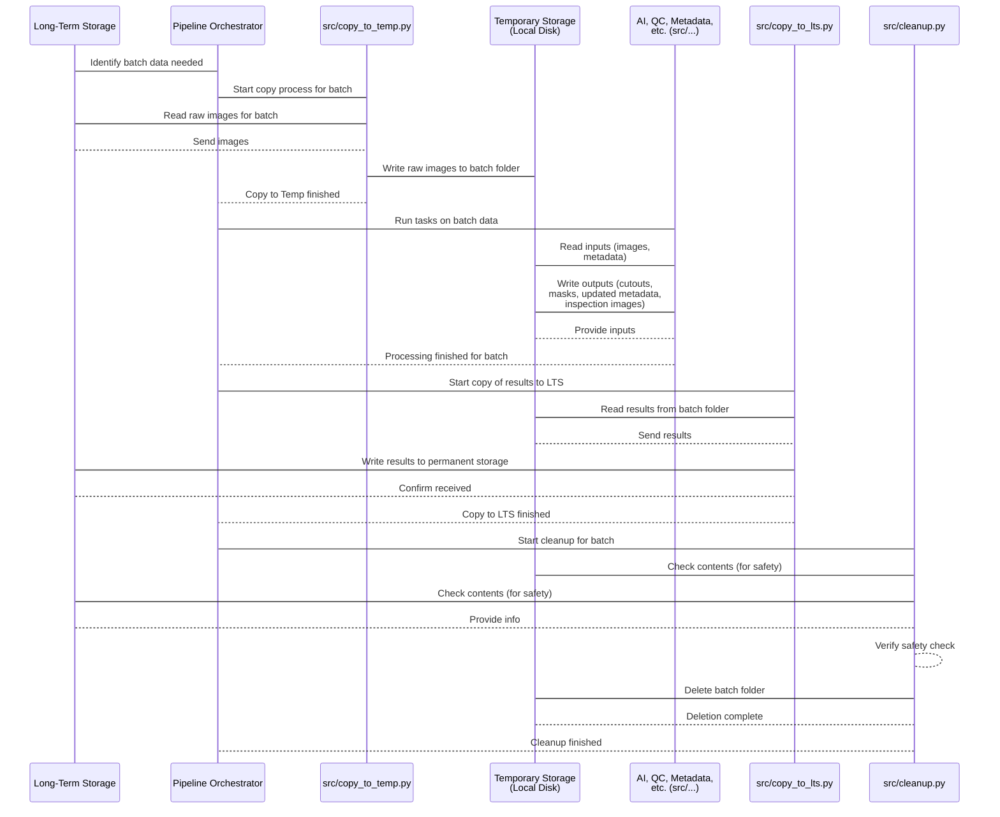

# Chapter 5: Temporary Storage

Welcome back! In the previous chapter, [Chapter 4: Pipeline Orchestrator](04_pipeline_orchestrator_.md), we saw how the Orchestrator acts as the project manager, reading the [Configuration](03_configuration_.md) ([Chapter 3](03_configuration_.md)) to decide which steps to run and in what order, and ensuring each task gets the information it needs (like the loaded `cfg` object).

Now, let's think about where the work actually *happens*. The raw images live permanently in [Long-Term Storage (LTS)](01_long_term_storage__lts__.md), which is like a big, shared library or archive. But you wouldn't typically do detailed work or analysis directly *in* a library archive, would you? You'd borrow the materials you need and take them to your desk or a workspace.

The **Temporary Storage** is exactly that workspace for the `Field-AnnotationPipeline`.

## What is Temporary Storage?

Temporary Storage is a dedicated directory on the specific computer or server where the pipeline is currently running. When the pipeline needs to process a particular group of images (a "batch"), it doesn't work on them directly in [LTS](01_long_term_storage__lts__.md). Instead, it:

1.  Copies the images and relevant files for that batch *from* [LTS](01_long_term_storage__lts__.md) into this local Temporary Storage directory.
2.  Performs *all* the processing steps (like running AI models, generating cutouts, performing quality checks) directly *within* this Temporary Storage location. All intermediate files and results for that batch are created and saved here.
3.  Once all processing for the batch is complete, it copies the *final* results (processed images, updated [Metadata](02_image_metadata_.md) files, inspection reports) *back to* [LTS](01_long_term_storage__lts__.md) for permanent archiving.
4.  Finally, the Pipeline Orchestrator often cleans up the Temporary Storage for that batch, deleting the files to free up local disk space.

It's the pipeline's short-term memory and active workspace for the specific task it's focused on right now.

## Why Do We Need Temporary Storage?

Working directly in [LTS](01_long_term_storage__lts__.md) for active processing would be slow and inefficient. [LTS](01_long_term_storage__lts__.md) might be on a remote network drive, or it might be too large to fit on the processing machine's fast local disk. Temporary Storage provides:

*   **Speed:** Accessing files on a local disk is much faster than over a network.
*   **Space:** Only the data for the currently processed batch needs to be stored locally, not the entire multi-terabyte [LTS](01_long_term_storage__lts__.md).
*   **Isolation:** Processing for one batch happens without interfering with other data in [LTS](01_long_term_storage__lts__.md) or other batches.
*   **Simplicity for Tasks:** Individual pipeline tasks can assume they are working with local files, simplifying their implementation.

## Where is Temporary Storage Defined?

Just like other important locations, the path to the Temporary Storage directory is defined in the project's [Configuration](03_configuration_.md). Specifically, you'll find it in the `conf/paths/default.yaml` file.

Let's look at the relevant part of the configuration:

```yaml
# conf/paths/default.yaml - Simplified
# directory paths
workdir: ${hydra:runtime.cwd} # Variable: project root
logdir: ${paths.workdir}/logging
datadir: ${paths.workdir}/data
temp_dir: ${paths.datadir}/temp # <-- This defines the temporary directory

# ... other paths ...
```

**Explanation:**

The line `temp_dir: ${paths.datadir}/temp` tells the pipeline where to create the temporary workspace. `${paths.datadir}` is a variable that resolves to the `data` directory within your project's working directory (`workdir`). So, by default, Temporary Storage will be located in a subdirectory named `temp` inside your project's `data` folder. When a batch is processed, a folder named after the `batch_id` (e.g., `AL_2023-08-17`) will be created inside `temp_dir` to hold its specific files.

## Temporary Storage in the Pipeline Workflow

Temporary Storage is central to the data flow for any batch being processed. Here's how it fits into the sequence managed by the [Pipeline Orchestrator](04_pipeline_orchestrator_.md):

1.  **Copy to Temp:** The pipeline starts by copying necessary files (like raw images) for the target batch *from* [LTS](01_long_term_storage__lts__.md) *to* a new directory created specifically for this batch inside the `temp_dir`. This is handled by a step like `copy_to_temp`.
2.  **Process in Temp:** All subsequent processing steps in the pipeline ([Build Metadata](02_image_metadata_.md), [AI Inference Tasks](07_ai_inference_tasks_.md), [Quality Inspection](08_quality_inspection_.md), etc.) read their input files *from* and write their output and intermediate files *to* subdirectories within this batch-specific temporary folder. The [Metadata](02_image_metadata_.md) JSON files, for instance, are built and updated right here in the temporary location, alongside the images and generated cutouts/masks.
3.  **Copy to LTS:** Once all processing for the batch is finished, the final results (generated cutouts, masks, updated metadata files, inspection images) are copied *from* the Temporary Storage location *back to* the correct location in [LTS](01_long_term_storage__lts__.md). This is handled by a step like `copy_to_lts` (which we briefly touched upon in [Chapter 1](01_long_term_storage__lts__.md)).
4.  **Cleanup Temp:** After confirming that the results have been successfully copied to [LTS](01_long_term_storage__lts__.md), the batch-specific temporary folder is removed to free up disk space. This is typically the `cleanup` step.

## How Data Moves To and From Temporary Storage (Code Examples)

Let's look at the code snippets that manage copying data *into* and *cleaning up* the Temporary Storage.

**Copying Data *To* Temporary Storage (`src/copy_to_temp.py`)**

This script is responsible for initiating the transfer of raw images from [LTS](01_long_term_storage__lts__.md) to the local temporary directory.

```python
# Simplified from src/copy_to_temp.py

class BatchDownloader:
    def __init__(self, cfg, batch_id: str):
        self.batch_id = batch_id
        # Get the LTS source path from config
        lts_base = Path(cfg.paths.longterm_storage)
        self.src_longterm_developed = lts_base / "field-batches" / self.batch_id / "developed-images"

        # Get the temporary destination path from config
        temp_base = Path(cfg.paths.temp_dir) # <-- Gets the temp_dir from config
        self.dst_temp_developed = temp_base / self.batch_id / "developed-images" # <-- Builds batch-specific path

        log.debug(f"LTS source: {self.src_longterm_developed}")
        log.debug(f"Temp destination: {self.dst_temp_developed}")

    def download_image(self, src: Path, dest: Path):
        # Uses standard file copy function
        shutil.copy2(src, dest)
        log.debug(f"Copied {src} to {dest}")

    def download_batch(self):
        # ... (code to find images in LTS to copy) ...
        self.dst_temp_developed.mkdir(parents=True, exist_ok=True) # Make the temp directory
        for file in images_to_copy: # Loop through images found in LTS
             self.download_image(file, self.dst_temp_developed / file.name) # Copy to temp
```

**Explanation:**

*   The `__init__` method reads the `longterm_storage` path and the `temp_dir` path from the `cfg` object (which contains the loaded [Configuration](03_configuration_.md)).
*   It then constructs the full source path in [LTS](01_long_term_storage__lts__.md) and the full destination path in the Temporary Storage directory (including the `batch_id` subdirectory).
*   The `download_batch` method makes sure the destination directory in Temporary Storage exists (`.mkdir(parents=True, exist_ok=True)`) and then loops through the identified images in [LTS](01_long_term_storage__lts__.md), copying each one to the correct spot in the temporary directory using `shutil.copy2`.

After this step, the raw images for the batch are available locally in Temporary Storage, ready for processing.

**Cleaning Up Temporary Storage (`src/cleanup.py`)**

This script is responsible for removing the batch's temporary folder and its contents *after* the results have been successfully copied back to [LTS](01_long_term_storage__lts__.md).

```python
# Simplified from src/cleanup.py

class CleanUpLocalTemp:
    def __init__(self, cfg, batch_id: str):
        self.batch_id = batch_id
        # Get the temporary paths from config
        temp_base = Path(cfg.paths.temp_dir) # <-- Gets the temp_dir from config
        self.temp_developed = temp_base / self.batch_id / "developed-images" # <-- Path in Temp
        self.temp_cutouts = temp_base / self.batch_id / "cutouts"         # <-- Path in Temp
        self.temp_inspected = temp_base / self.batch_id / "inspection"     # <-- Path in Temp

        # Get the corresponding LTS paths (for safety check)
        lts_base = Path(cfg.paths.longterm_storage)
        self.lts_developed = lts_base / "field-batches" / self.batch_id / "developed-images" # <-- Path in LTS
        self.lts_cutouts = lts_base / "field-batches" / self.batch_id / "cutouts"         # <-- Path in LTS
        self.lts_inspected = lts_base / "field-batches" / self.batch_id / "inspection"     # <-- Path in LTS


    def can_remove_local_dir(self):
        """ Check that files match LTS before deleting locally. """
        # Simplified check: In real code, this compares file lists in temp vs LTS
        # to make sure everything was copied successfully.
        log.info("Performing safety check before cleanup...")
        # This part is complex and skipped for simplicity here.
        # It ensures files in temp have corresponding files in LTS.
        check_passed = True # Assume it passes for this example

        if not check_passed:
             log.error("Cleanup safety check failed. Temp files not deleted.")
             return False
        else:
             log.info("Cleanup safety check passed.")
             return True


    def cleanup_temp(self):
        """Remove the batch_id folder from the temp directory."""
        can_remove = self.can_remove_local_dir() # Run safety check
        if not can_remove:
            return # Don't delete if safety check fails

        try:
            # Use shutil.rmtree to delete the entire folder
            shutil.rmtree(Path(self.cfg.paths.temp_dir) / self.batch_id) # Delete the main batch folder
            log.info(f"Removed temp directory for batch {self.batch_id}.")
        except Exception as e:
            log.error(f"Failed to remove temp directory for batch {self.batch_id}: {e}")

```

**Explanation:**

*   The `__init__` method again reads the `temp_dir` path from the `cfg` object and constructs the paths to the specific batch's folders within Temporary Storage (where the processed data, cutouts, inspection images, etc., reside). It also gets the corresponding paths in [LTS](01_long_term_storage__lts__.md).
*   The `can_remove_local_dir` method (simplified here) is a crucial safety check. It verifies that the files generated and processed in Temporary Storage have indeed been successfully copied to their permanent home in [LTS](01_long_term_storage__lts__.md) before attempting to delete the local copies. This prevents accidental data loss.
*   The `cleanup_temp` method calls the safety check. If the check passes, it uses `shutil.rmtree()` to recursively delete the entire directory structure for that specific batch within the `temp_dir`, freeing up local disk space.

## The Temporary Storage Workflow Summary

Here's how Temporary Storage fits into the overall process managed by the [Pipeline Orchestrator](04_pipeline_orchestrator_.md):



This diagram illustrates that Temporary Storage is the hub for activity between the initial data retrieval from [LTS](01_long_term_storage__lts__.md) and the final archiving back to [LTS](01_long_term_storage__lts__.md). All the intensive processing happens locally within this workspace.

## Conclusion

Temporary Storage serves as the pipeline's essential local workspace for processing a specific batch of images. Data is brought here from [LTS](01_long_term_storage__lts__.md), processed efficiently on local disk, and results are stored here temporarily before being copied back to [LTS](01_long_term_storage__lts__.md) and the workspace is cleared. It's a critical concept for managing resources and enabling high-performance processing.

Speaking of moving data, how does the pipeline ensure that the data in Temporary Storage is what it expects, and how does it handle scenarios where data might already exist locally or needs to be updated? This involves **Asset Synchronization**, which we will explore in the next chapter.

[Chapter 6: Asset Synchronization](06_asset_synchronization_.md)

---

Generated by [AI Codebase Knowledge Builder](https://github.com/The-Pocket/Tutorial-Codebase-Knowledge)