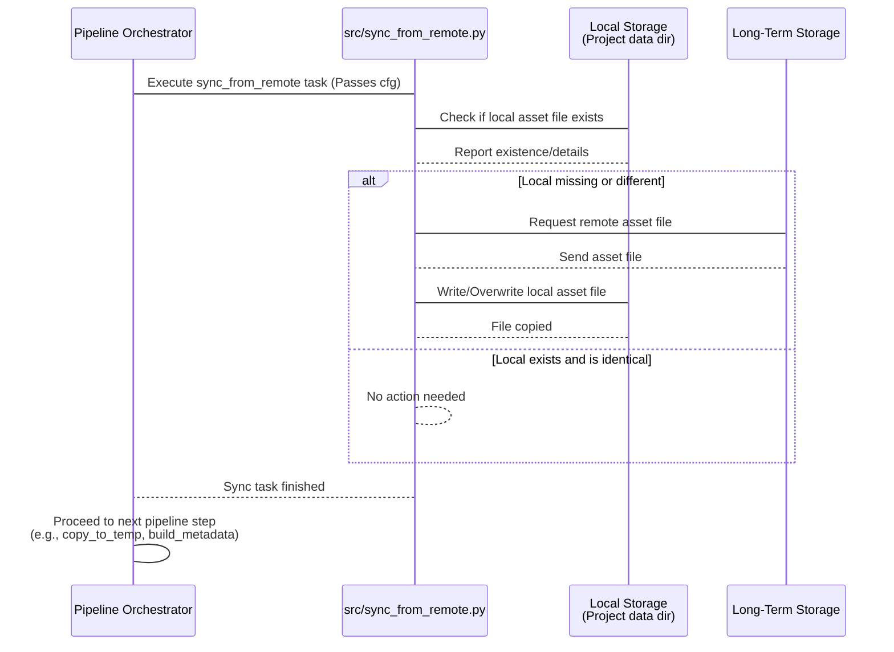

# Chapter 6: Asset Synchronization

Welcome back to the tutorial! In the last chapter, [Chapter 5: Temporary Storage](05_temporary_storage_.md), we learned about the local workspace where the pipeline actively processes a batch of images. Data is copied *to* this temporary area from [Long-Term Storage (LTS)](01_long_term_storage__lts__.md), processed locally for speed, and then the results are copied *back to* [LTS](01_long_term_storage__lts__.md).

But before the pipeline can even start processing a batch, it needs some essential tools and reference materials. Think about running a software program – it often needs specific files (like libraries or configuration settings) installed on your computer to work correctly. Our pipeline is similar. It needs things like the trained AI model files (the "brains") and the main table of field data ([Metadata](02_image_metadata_.md) about all images, not just the current batch) to perform its tasks.

These crucial files are also stored permanently in [LTS](01_long_term_storage__lts__.md). But just like the raw images, we need to make sure the *local* copy of these files on the processing machine is present and is the *latest* version before we start. If the local files are missing, old, or different from what's in [LTS](01_long_term_storage__lts__.md), the pipeline might use outdated models or work with incorrect data, leading to bad results.

This is where **Asset Synchronization** comes in.

## What is Asset Synchronization?

Asset Synchronization is the process of ensuring that specific, important project files needed by the pipeline are up-to-date on the local machine running the pipeline, compared to the authoritative versions stored in [Long-Term Storage (LTS)](01_long_term_storage__lts__.md).

Imagine you have a shared online drive ([LTS](01_long_term_storage__lts__.md)) where the project team keeps the latest versions of important documents, like the most recent AI model (`latest_model.pt`) or the master list of all field data (`master_data.csv`). Before you start processing on your computer, you run a sync step. This step checks:

1.  "Do I have `latest_model.pt` and `master_data.csv` on my computer?"
2.  "If yes, are they exactly the same as the versions on the shared drive?"

If you're missing a file, or your local copy is different (older or perhaps accidentally modified), the sync process automatically downloads the correct version from the shared drive ([LTS](01_long_term_storage__lts__.md)) to your computer.

The main "assets" the pipeline needs to sync are:

*   **Trained AI Model Files:** The files containing the learned knowledge of the AI models for detecting weeds, classifying plants, or segmenting images. These are usually `.pt` or `.pth` files.
*   **Main Metadata Table:** A central file (often a `.csv`) containing core metadata information about *all* images or relevant field data, which might be needed as a lookup source by pipeline tasks (different from the per-image metadata JSONs we discussed in [Chapter 2](02_image_metadata_.md)).
*   **Species/Lookup Information:** Other small lookup files (like a `.json` file mapping species names to IDs) that the pipeline uses.

These assets are typically placed in specific, permanent locations within the project's local `data` directory, not inside the batch-specific [Temporary Storage](05_temporary_storage_.md) folder.

## Why is Asset Synchronization Important?

*   **Consistency:** Ensures everyone running the pipeline uses the exact same, approved versions of models and data lookups.
*   **Correctness:** Prevents errors or poor performance that could result from using outdated AI models or incorrect reference data.
*   **Reliability:** The pipeline can assume these core assets are correctly in place before starting computationally intensive tasks.
*   **Efficiency:** Only downloads files if they are missing or outdated, saving bandwidth and time on subsequent runs.

## Our Use Case: Preparing the Environment

Let's revisit our example from [Chapter 3: Configuration](03_configuration_.md). Before we can run the `detect_weeds` or `inspection` steps for batch `AL_2023-08-17`, the pipeline needs the weed detection model and the main metadata table.

The use case for Asset Synchronization is: **Ensure that the required AI models and the main metadata table are the latest versions from [LTS](01_long_term_storage__lts__.md) before the pipeline attempts to use them.**

## How it Works (High-Level)

The Asset Synchronization process, typically handled by a dedicated step early in the pipeline sequence, performs these actions:

1.  **Identify Assets:** It knows which specific files (models, tables, etc.) need to be synced and where their local and remote ([LTS](01_long_term_storage__lts__.md)) copies should be. This information comes from the [Configuration](03_configuration_.md).
2.  **Check Existence:** For each asset, it checks if the local file exists. If not, it flags it for download.
3.  **Compare Versions:** If the local file *does* exist, it compares its content (often using a digital fingerprint called a "hash") with the content of the remote file in [LTS](01_long_term_storage__lts__.md).
4.  **Update if Needed:** If the local file is missing or the content differs from the remote version, it copies the remote file to the local machine, overwriting the old version if it existed.
5.  **Report Status:** It logs messages indicating which files were checked, which were missing or outdated, and which were updated.

This process happens before the main processing tasks begin.

## Where is Synchronization Defined?

The Asset Synchronization step is included in the list of steps the [Pipeline Orchestrator](04_pipeline_orchestrator_.md) should execute, as defined in your `conf/config.yaml`.

Look at the `pipeline` list in `conf/config.yaml` (simplified):

```yaml
# conf/config.yaml - Simplified
pipeline:
  - find_unprocessed_batches
  - sync_from_remote   # <-- This is the Asset Synchronization step
  # - copy_to_temp     # (Happens after sync)
  # - build_metadata   # (Uses synced files, like species info)
  - detect_weeds       # (Uses synced model)
  # - unet_segment_weeds # (Uses synced model)
  - inspection
  # - copy_to_lts
  # - cleanup

batch_id: AL_2023-08-17

# ... other settings ...
```

The `sync_from_remote` entry in the `pipeline` list tells the [Pipeline Orchestrator](04_pipeline_orchestrator_.md) to run the synchronization logic at this point in the workflow. Placing it early ensures that the necessary assets are available before steps like `build_metadata` (which might need the species info file) or `detect_weeds` (which needs the model file) are executed.

## How to Use It

To use Asset Synchronization for your pipeline run, you simply need to make sure the `sync_from_remote` step is uncommented and included in the `pipeline` list in your `conf/config.yaml` file:

```yaml
pipeline:
  # ... other steps ...
  - sync_from_remote # Make sure this line is NOT commented out
  # ... other steps ...
```

When the [Pipeline Orchestrator](04_pipeline_orchestrator_.md) reaches this step in the sequence, it will execute the synchronization logic defined for `sync_from_remote`. You don't need to manually download or check these files yourself; the pipeline handles it automatically based on the configuration.

## Under the Hood (Simplified)

The code responsible for Asset Synchronization is located in `src/sync_from_remote.py`. This script gets the list of files to sync from the loaded configuration and performs the check and update logic.

Here's a simplified look at the core logic in `src/sync_from_remote.py`:

1.  **Get File List from Config:** The script defines a dictionary listing the important files it needs to sync. The local and remote paths for these files are read directly from the `cfg` object, which contains your loaded [Configuration](03_configuration_.md) (especially the paths defined in `conf/paths/default.yaml`).

    ```python
    # Simplified from src/sync_from_remote.py

    from pathlib import Path
    from omegaconf import DictConfig # For type hinting cfg

    # Assume other necessary imports like hashlib, shutil, logging are here

    def main(cfg: DictConfig) -> None:
        """Checks if local files are up to date and updates if necessary."""
        log.info("Starting asset synchronization...")

        # This dictionary lists the files to sync.
        # Local paths are read from the configuration (conf/paths/default.yaml).
        # Remote paths are hardcoded or also read from config if needed.
        files_to_sync = {
            "weed_detection_model": {
                "local": Path(cfg.paths.yolo_weed_detection_model),
                "remote": Path("/mnt/research-projects/r/raatwell/longterm_images3/field-tools/models/yolo_weed_detection/weights/best.pt"), # Example remote path in LTS
            },
            "main_metadata_table": {
                "local": Path(cfg.paths.merged_tables_permanent),
                "remote": Path("/mnt/research-projects/r/raatwell/longterm_images3/field-tools/persistent_data_tables/merged_blobs_tables_metadata_lts.csv"), # Example remote path in LTS
            },
            "species_info_lookup": { # Example of another asset
                 "local": Path(cfg.paths.field_species_info),
                 "remote": Path("/mnt/research-projects/r/raatwell/longterm_images3/field-tools/species_info.json"), # Example remote path in LTS
            }
            # ... other models/files listed here ...
        }

        # ... (Looping and checking logic below) ...
    ```
    *Explanation:* The `main` function receives the `cfg` object. It then creates the `files_to_sync` dictionary, mapping a descriptive name (like `"weed_detection_model"`) to a smaller dictionary containing the `local` and `remote` paths for that asset. Notice how the local paths use `Path(cfg.paths....)` to get the values you defined in `conf/paths/default.yaml`. The remote paths are the specific locations in [LTS](01_long_term_storage__lts__.md).

2.  **Loop and Check Each File:** The script then loops through each item in the `files_to_sync` dictionary. For each file pair, it performs the checks.

    ```python
    # Simplified from src/sync_from_remote.py (continuing from above)

        for name, paths in files_to_sync.items():
            local_path = paths["local"]
            remote_path = paths["remote"]
            log.debug(f"Checking {name}: Local='{local_path}', Remote='{remote_path}'")

            # --- Check 1: Does the remote file exist? ---
            if not remote_path.exists():
                log.warning(f"Remote file {remote_path} does not exist. Skipping sync for {name}.")
                continue # Skip this file and go to the next one

            # --- Check 2: Does the local file exist? ---
            if not local_path.exists():
                log.info(f"Local file {local_path} missing. Downloading {name}...")
                update_file(local_path, remote_path) # Call function to copy remote to local
                continue # Local file is now updated, move to next file

            # --- Check 3: If both exist, are they identical? ---
            # This function compares their 'hashes' (digital fingerprints)
            if files_are_identical(local_path, remote_path):
                log.info(f"{name}: Local file is up-to-date.")
            else:
                log.warning(f"Local {name} is outdated or different from remote. Updating...")
                update_file(local_path, remote_path) # Call function to copy remote to local

        log.info("Asset synchronization finished.")

    # Assume files_are_identical and update_file functions are defined elsewhere
    # files_are_identical calculates hash for both files and compares them
    # update_file creates local parent directory if needed and copies the file
    ```
    *Explanation:* The loop iterates through the `files_to_sync` items. It first checks if the remote file exists (cannot sync if the source is missing!). If the remote exists, it checks if the local file exists. If the local file is missing, it logs a message and calls `update_file` to copy the remote version. If *both* local and remote exist, it calls `files_are_identical`. This function calculates a unique "digital fingerprint" (a hash) for the content of each file and compares them. If the hashes don't match, it means the files are different, so `update_file` is called again to get the latest version. If the hashes match, the file is up-to-date, and it moves to the next asset.

The actual `files_are_identical` and `update_file` functions involve standard Python file operations (`hashlib` for hashing, `shutil.copy2` for copying, `Path.mkdir` for creating directories), but the logic shown above is the core of *how* the synchronization decides what to do.

## The Asset Synchronization Workflow

Here's a simple diagram showing how Asset Synchronization fits into the early part of the pipeline workflow:



This diagram shows that the synchronization task, initiated by the [Orchestrator](04_pipeline_orchestrator_.md), directly interacts with both the local machine's storage (where the assets *should* be) and [LTS](01_long_term_storage__lts__.md) (where the authoritative versions are). It makes a decision for each required asset and updates the local copy if necessary before the pipeline continues.

## Conclusion

Asset Synchronization is a vital preliminary step in the `Field-AnnotationPipeline`. By including the `sync_from_remote` step in your pipeline [Configuration](03_configuration_.md), you ensure that critical project-level assets like trained AI models and main data tables are present and up-to-date on your local machine before any processing begins. This guarantees consistency, prevents errors, and provides a stable foundation for the steps that follow.

With the core assets synchronized and ready, the pipeline is now prepared to use these tools to process the images. The next crucial step involves applying the synchronized AI models to the images to find the plants we're looking for. We'll delve into this in the next chapter: [AI Inference Tasks](07_ai_inference_tasks_.md).

[Chapter 7: AI Inference Tasks](07_ai_inference_tasks_.md)

---

Generated by [AI Codebase Knowledge Builder](https://github.com/The-Pocket/Tutorial-Codebase-Knowledge)