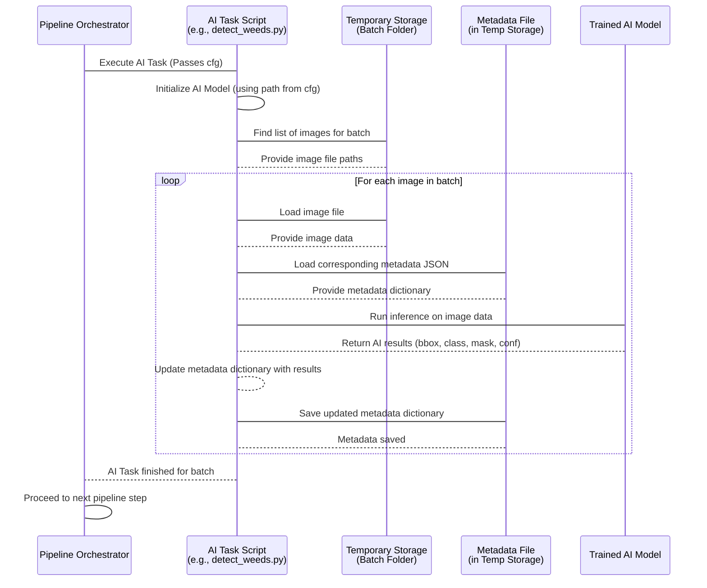

# Chapter 7: AI Inference Tasks

Welcome back to the tutorial! In our previous chapters, we've built a solid foundation: we know where our data lives permanently in [Long-Term Storage (LTS)](01_long_term_storage__lts__.md) ([Chapter 1](01_long_term_storage__lts__.md)), how we track detailed information about each image using [Image Metadata](02_image_metadata_.md) ([Chapter 2](02_image_metadata_.md)), how we tell the pipeline what to do using [Configuration](03_configuration_.md) ([Chapter 3](03_configuration_.md)), how the [Pipeline Orchestrator](04_pipeline_orchestrator_.md) ([Chapter 4](04_pipeline_orchestrator_.md)) runs everything, how we use [Temporary Storage](05_temporary_storage_.md) ([Chapter 5](05_temporary_storage_.md)) as our local workspace, and how [Asset Synchronization](06_asset_synchronization_.md) ([Chapter 6](06_asset_synchronization_.md)) ensures we have the latest tools (like AI models) ready.

Now that the images are in our [Temporary Storage](05_temporary_storage_.md) workspace and our AI models are synced and ready to go, it's time for the pipeline to perform its core analysis work. This is where the "Artificial Intelligence" part of the pipeline really happens!

## What are AI Inference Tasks?

**AI Inference Tasks** are the specific steps in the pipeline that apply trained Artificial Intelligence models to process the images.

Think of these as specialized AI tools that analyze the images to find specific things or features we're interested in. Instead of a human looking at thousands of images to find every weed or draw every plant shape, these AI tools automate that analysis.

When we say "inference," we mean using an already trained AI model to make predictions or analyze *new*, unseen data (our images), as opposed to "training," which is the process of teaching the model in the first place.

## What Kinds of AI Tasks Does the Pipeline Use?

This pipeline uses different types of AI tasks, each performing a specific kind of analysis:

1.  **Object Detection:** This task looks for specific objects (like a target weed plant) in an image and draws a **bounding box** around them. A bounding box is simply a rectangle indicating the location and size of the detected object. The AI also provides a confidence score indicating how sure it is about the detection.
2.  **Image Classification:** This task analyzes an entire image (or a specific area within it) and assigns a label or category to it. For example, it might classify an image as containing a "dense vegetation mat" or "bare soil". It also gives a confidence score for its prediction.
3.  **Image Segmentation:** This is a more detailed task that identifies the exact shape and boundaries of an object. Instead of a box, it creates a **mask** – a set of pixels that belong to the object (like a plant's leaves) distinct from the background. This gives a pixel-level outline.

The pipeline can include one or more of these tasks depending on what kind of information you need to extract from the images.

## Our Use Case: Applying AI to Find Weeds and Identify Mats

Let's continue with our use case: We want to process batch `AL_2023-08-17` and run weed detection and perhaps classify images based on vegetation density.

The use case for AI Inference Tasks is: **For each image in the batch in [Temporary Storage](05_temporary_storage_.md), run the trained weed detection model to find weeds and the mat classification model to check for dense vegetation, and record the results in the image's [Metadata](02_image_metadata_.md).**

## How AI Tasks Fit in the Pipeline Workflow

AI Inference Tasks are crucial steps executed by the [Pipeline Orchestrator](04_pipeline_orchestrator_.md). They happen *after* the images are copied to [Temporary Storage](05_temporary_storage_.md) and the necessary AI models are synced via [Asset Synchronization](06_asset_synchronization_.md).

Here's where they typically appear in the `pipeline` list within `conf/config.yaml`:

```yaml
# conf/config.yaml - Simplified snippet
pipeline:
  # ... steps before AI ...
  - copy_to_temp         # Images copied to Temp Storage
  - build_metadata       # Initial metadata created in Temp Storage
  - sync_from_remote     # Models synced to local data directory
  - classify_mat         # <-- An AI Classification Task
  - detect_weeds         # <-- An AI Detection Task
  # - unet_segment_weeds # <-- An AI Segmentation Task (if needed)
  # ... steps after AI ...
  - inspection           # Uses AI results from metadata
  - copy_to_lts          # Saves results (including updated metadata) to LTS
  # ... cleanup ...

batch_id: AL_2023-08-17

# ... other settings ...
```
As you can see, the AI tasks (`classify_mat`, `detect_weeds`, `unet_segment_weeds`) are listed after the data is available locally ([Temporary Storage](05_temporary_storage_.md)) and the models are ready ([Asset Synchronization](06_asset_synchronization_.md)). They are positioned before steps that use their results, like [Quality Inspection](08_quality_inspection_.md).

## How to Configure Which AI Tasks Run

To include an AI Inference Task in your pipeline run, you simply uncomment its name in the `pipeline` list in your `conf/config.yaml` file.

For our use case (weed detection and mat classification), you would ensure these lines are uncommented:

```yaml
pipeline:
  # ...
  - classify_mat   # Uncomment this line to run mat classification
  - detect_weeds   # Uncomment this line to run weed detection
  # - unet_segment_weeds # Keep this commented out if not needed
  # ...
```

Each AI task might also have specific settings defined in the configuration, such as the minimum confidence score required to consider a detection valid. These settings would appear in their dedicated section in `config.yaml` (similar to the `inspection` settings we saw in [Chapter 3](03_configuration_.md)), but we'll keep the focus on the task itself for this beginner chapter.

## How AI Tasks Work (Under the Hood)

Each AI Inference Task is implemented in a dedicated Python script (e.g., `src/detect_weeds.py`, `src/classify_mat.py`, `src/unet_segment_weeds.py`). These scripts are called by the [Pipeline Orchestrator](04_pipeline_orchestrator_.md) as part of the defined workflow.

Here's a general look at what happens inside an AI task script for a single image:

1.  **Load Configuration:** The script receives the `cfg` object containing all pipeline settings, thanks to the [Pipeline Orchestrator](04_pipeline_orchestrator_.md).
2.  **Initialize AI Model:** It loads the trained AI model from the path specified in the `cfg` object. Since we ran [Asset Synchronization](06_asset_synchronization_.md) earlier, the model file is guaranteed to be present and up-to-date locally.
3.  **Find Images in Temporary Storage:** It looks in the batch-specific folder within [Temporary Storage](05_temporary_storage_.md) to find all the images it needs to process.
4.  **Loop Through Images:** It processes each image one by one (or sometimes in small groups called "batches" for efficiency, but conceptually, it's processing each image).
5.  **Load Image and Metadata:** For the current image, it loads the image file itself and its corresponding [Metadata](02_image_metadata_.md) JSON file from [Temporary Storage](05_temporary_storage_.md).
6.  **Run AI Model:** It feeds the image (or a relevant part of it, like a cropped section) into the loaded AI model.
7.  **Get AI Results:** The AI model outputs its prediction – a bounding box and confidence, a classification label and confidence, or a segmentation mask.
8.  **Update Metadata:** This is a critical step. The script takes the AI results and adds them to the dictionary representation of the image's [Metadata](02_image_metadata_.md). For example, the weed detection task adds the bounding box coordinates (`bbox`) and confidence score (`det_pred_conf`) to the `"annotation"` section of the metadata dictionary.
9.  **Save Updated Metadata:** The modified metadata dictionary is saved back to the original JSON file in [Temporary Storage](05_temporary_storage_.md), overwriting the previous version. This updates the image's "ID card" with the AI's findings.
10. **(Optional) Save Generated Files:** Some tasks, like segmentation or detection, might also save new image files (like the created masks or cropped out sections of the image) into the batch's folder in [Temporary Storage](05_temporary_storage_.md).

This process repeats for every image in the batch.

### Code Examples (Simplified)

Let's look at simplified snippets showing key parts of this process using `src/detect_weeds.py` and `src/classify_mat.py` as examples.

**1. Initializing the AI Model and Getting Paths (from `detect_weeds.py`)**

```python
# Simplified snippet from src/detect_weeds.py

from pathlib import Path
from ultralytics import YOLO # Library for AI models
from omegaconf import DictConfig

class WeedDetector:
    def __init__(self, model_path: str) -> None:
        # Load the YOLO model from the specified path
        self.model = YOLO(model_path)

class ProcessDetections:
    def __init__(self, cfg: DictConfig):
        # Get the temp directory from configuration
        self.output_dir = Path(cfg.paths.temp_dir)
        self.batch_id = cfg.batch_id
        # Initialize the WeedDetector, passing the model path from configuration
        self.weed_detector = WeedDetector(cfg.paths.yolo_weed_detection_model)

    # ... methods for processing images follow ...
```
**Explanation:** The `ProcessDetections` class, which orchestrates the task, reads the `temp_dir` and `batch_id` from the `cfg` object. Crucially, it initializes the `WeedDetector` by passing `cfg.paths.yolo_weed_detection_model` to it. This path, defined in your `conf/paths/default.yaml` and loaded by the [Configuration](03_configuration_.md) system, tells the `WeedDetector` exactly which model file to load using the `YOLO()` function from the `ultralytics` library.

**2. Loading Image and Metadata, Running AI, and Updating Metadata (from `detect_weeds.py`)**

```python
# Simplified snippet from src/detect_weeds.py (inside ProcessDetections class)

    def load_metadata(self, metadata_path: Path) -> Dict:
        # Read the JSON file into a Python dictionary
        with open(metadata_path, "r") as file:
            metadata = json.load(file)
        return metadata

    def update_metadata(self, metadata_path: Path, metadata: dict) -> None:
        # Save the modified dictionary back to the JSON file
        with open(metadata_path, "w") as file:
            json.dump(metadata, file, indent=4, default=str)
        log.debug(f"Metadata saved to {metadata_path.name}.")

    def process_image_sequentially(self, image_path: Path) -> None:
        batch_dir = image_path.parent.parent

        # 1. Construct the path to the metadata file in Temp Storage
        metadata_path = batch_dir / "cutouts" / f"{image_path.stem}_0.json"

        # 2. Load the existing metadata dictionary
        metadata = self.load_metadata(metadata_path)

        # 3. Run the AI detection model on the image
        # The detect_weeds method handles loading the image internally
        detection_results = self.weed_detector.detect_weeds(image_path)

        # 4. Update the metadata dictionary with the results
        metadata["annotation"]["bbox"] = detection_results.get("bbox", None)
        metadata["annotation"]["det_pred_conf"] = detection_results.get("det_pred_conf", None)

        # 5. Save the updated metadata back to the file
        self.update_metadata(metadata_path, metadata)

    # ... The process_images method loops through all images and calls process_image_sequentially ...
```
**Explanation:** The `process_image_sequentially` function is the core logic for one image. It first calculates where the metadata JSON file should be (next to the image's cutout in the batch folder within [Temporary Storage](05_temporary_storage_.md)). It uses `load_metadata` to read the existing JSON into a Python dictionary. Then, it calls `self.weed_detector.detect_weeds(image_path)` to run the AI model on the image. The results (bbox and confidence) are extracted from the `detection_results` dictionary returned by the AI model. These results are assigned to the corresponding fields (`"bbox"`, `"det_pred_conf"`) within the `metadata["annotation"]` dictionary. Finally, `update_metadata` saves the modified dictionary back to the JSON file.

**3. Another Example: Mat Classification (from `classify_mat.py`)**

This snippet shows how a different AI task (`classify_mat`) similarly loads metadata, runs a different AI model (`MatClassifier`), and updates different fields in the metadata (`"HasMatPred"`, `"HasMatPredConf"`).

```python
# Simplified snippet from src/classify_mat.py (inside ProcessDetections class)

    def process_image_sequentially(self, image_path: Path) -> None:
        batch_dir = image_path.parent.parent

        # 1. Construct the path to the metadata file in Temp Storage
        metadata_path = batch_dir / "cutouts" / f"{image_path.stem}_0.json"

        # 2. Load the existing metadata dictionary
        metadata = self.load_metadata(metadata_path)

        # 3. Run the AI classification model on the image
        # The classify_image method loads the image internally
        classification_results = self.weed_classifier.classify_image(image_path)

        # 4. Update the metadata dictionary with the classification results
        metadata["annotation"]["HasMatPred"] = classification_results["HasMatPred"]
        metadata["annotation"]["HasMatPredConf"] = classification_results["HasMatPredConf"]

        # 5. Save the updated metadata back to the file
        self.update_metadata(metadata_path, metadata)

    # ... The process_images method loops through all images ...
```
**Explanation:** The structure is very similar! Load metadata, run the AI model (`self.weed_classifier.classify_image`), get the results (`classification_results`), update specific fields in the metadata dictionary (`"HasMatPred"`, `"HasMatPredConf"` in the `"annotation"` section), and save the updated metadata. This highlights the consistent pattern across different AI tasks.

## The AI Inference Task Workflow

Here's a diagram showing the workflow for a single AI task script processing multiple images within a batch:



This diagram shows that the AI task script orchestrates the process for its specific task, loading the model once, and then iterating through each image in the batch located in [Temporary Storage](05_temporary_storage_.md), updating the image's metadata with the AI's findings.

## Conclusion

AI Inference Tasks are where the core image analysis powered by Artificial Intelligence takes place in the `Field-AnnotationPipeline`. These tasks, such as object detection, image classification, and image segmentation, apply trained models to images residing in [Temporary Storage](05_temporary_storage_.md). The crucial outcome of these tasks is the enrichment of the image's [Image Metadata](02_image_metadata_.md) with the AI's predictions and confidence scores. By configuring which AI tasks run, you dictate the type of automated analysis performed on your images.

After the AI has done its work and updated the metadata, it's important to check the results. Are the bounding boxes accurate? Did the segmentation masks capture the plant correctly? The next step in the pipeline involves reviewing these AI outputs, which brings us to **Quality Inspection**.

[Chapter 8: Quality Inspection](08_quality_inspection_.md)

---

Generated by [AI Codebase Knowledge Builder](https://github.com/The-Pocket/Tutorial-Codebase-Knowledge)