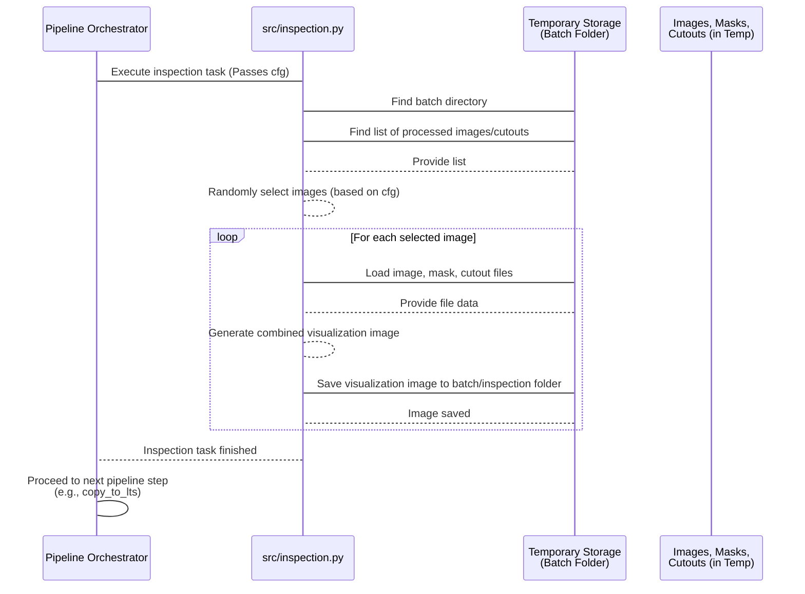
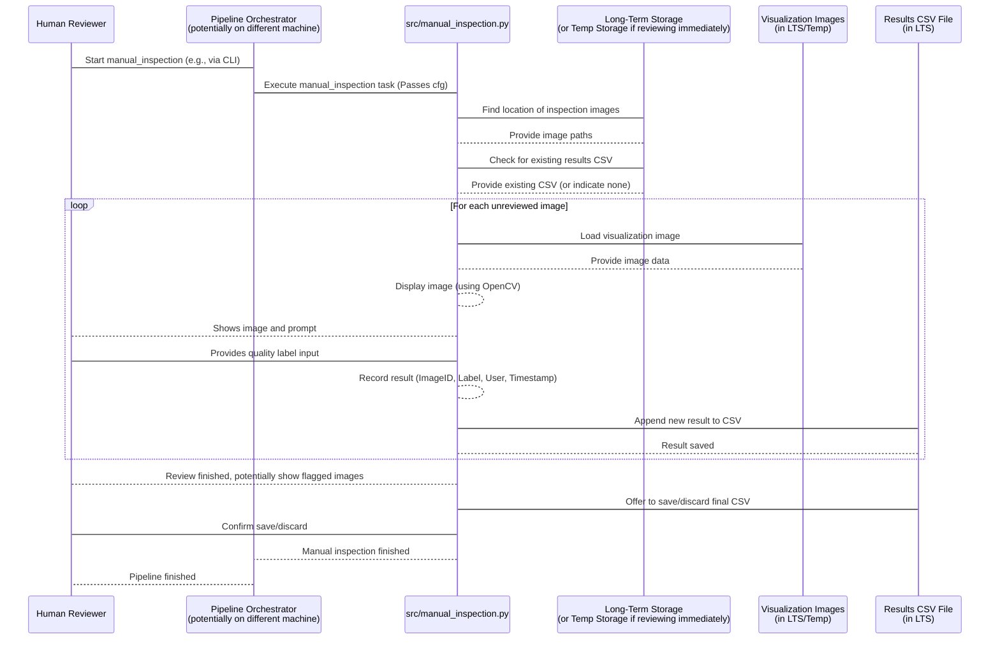

# Chapter 8: Quality Inspection

Welcome back! We've made significant progress in understanding the `Field-AnnotationPipeline`. We know our data's permanent home is [Long-Term Storage (LTS)](01_long_term_storage__lts__.md) ([Chapter 1](01_long_term_storage__lts__.md)), how we track details about each image with [Image Metadata](02_image_metadata_.md) ([Chapter 2](02_image_metadata_.md)), how we customize the pipeline's behavior using [Configuration](03_configuration_.md) ([Chapter 3](03_configuration_.md)), and how the [Pipeline Orchestrator](04_pipeline_orchestrator_.md) ([Chapter 4](04_pipeline_orchestrator_.md)) runs everything. We've also seen how [Temporary Storage](05_temporary_storage_.md) ([Chapter 5](05_temporary_storage_.md)) is our local workspace and how [Asset Synchronization](06_asset_synchronization_.md) ([Chapter 6](06_asset_synchronization_.md)) keeps our tools up-to-date. Most recently, we explored [AI Inference Tasks](07_ai_inference_tasks_.md) ([Chapter 7](07_ai_inference_tasks_.md)), where the AI models analyze images and update their metadata with predictions like bounding boxes and segmentation masks.

Now, after the AI has worked its magic, we need to ask a crucial question: **How good are the results?** AI models aren't perfect, especially when dealing with variable field conditions. A bounding box might be slightly off, a segmentation mask might miss part of a leaf, or the AI might detect the wrong species.

Before we finalize the processed data and use it for further analysis or training, it's essential to perform a **Quality Inspection**.

## What is Quality Inspection?

Quality Inspection in this pipeline is about checking the outputs generated by the processing steps, particularly the results from the [AI Inference Tasks](07_ai_inference_tasks_.md). It's a crucial quality control step.

The pipeline offers two main ways to do this:

1.  **Automated Visualization (`inspection`):** The pipeline automatically generates visual images that combine the original image, the AI's outputs (like masks or bounding boxes), and potentially other processed data (like cutouts). These visualization images are saved for later review. This is fast and scalable as it requires no human interaction during the pipeline run itself.
2.  **Manual Review (`manual_inspection`):** A human user reviews the images (often the visualization images created by the automated step) and manually assigns a quality label to each one (e.g., "Good", "Bad Mask", "Incorrect Species"). This requires human effort but provides detailed, subjective quality feedback.

Both methods aim to give you confidence in your data quality or identify images/batches that need further attention.

## Our Use Case: Checking AI Outputs

Following our ongoing example, after running the `detect_weeds` and potentially `unet_segment_weeds` tasks for batch `AL_2023-08-17`, we want to verify the quality of the generated bounding boxes and segmentation masks.

The use case for Quality Inspection is: **Generate visualization images showing the AI results for a subset of images in batch `AL_2023-08-17` and then manually review those images to label their quality.**

## How to Use Quality Inspection (Configuration)

Quality Inspection is included in the pipeline workflow by adding the corresponding steps to the `pipeline` list in your `conf/config.yaml`.

Here's how you'd configure the pipeline to include both automated visualization (`inspection`) and manual review (`manual_inspection`) for our use case:

```yaml
# conf/config.yaml - Simplified snippet
pipeline:
  # ... steps before AI ...
  - classify_mat
  - detect_weeds
  - unet_segment_weeds # Assuming segmentation was run

  - inspection       # <-- Automated visualization step
  # - copy_to_lts    # Automated inspection results might be copied here first
  # - cleanup        # (Cleanup happens later)
  - manual_inspection # <-- Manual review step (often runs after data is back in LTS)
  # ... steps after QC ...
  # - copy_to_lts    # Manual inspection results (CSV) are saved here
  # - cleanup

batch_id: AL_2023-08-17

inspection:
  num_random_images_to_inspect: 10 # <-- How many images to visualize

# ... other settings ...
```

**Explanation:**

*   We uncomment `inspection` to automatically generate the visualization images.
*   We uncomment `manual_inspection` to enable the interactive manual review process.
*   The `inspection` step has a parameter `num_random_images_to_inspect`. In this example, we set it to `10`, meaning the automated visualization will randomly select 10 images from the batch to generate inspection plots for. This helps keep the visualization manageable if a batch has thousands of images.

Notice the order: `inspection` usually runs right after the AI tasks that generate the outputs to be inspected. `manual_inspection` often runs as a *separate* pipeline execution or after the results (including the visualization images from `inspection`) have been copied back to [LTS](01_long_term_storage__lts__.md) via `copy_to_lts`, because manual review is a human task and might happen on a different machine or at a different time.

To perform our use case (automated visualization *and* manual review), you would likely run the pipeline *twice*:

1.  First run: Include steps up to `inspection` and `copy_to_lts` (to save the generated inspection images permanently).
2.  Second run: Configure the pipeline to *only* run `manual_inspection` (potentially on a different machine with access to [LTS](01_long_term_storage__lts__.md)).

However, for simplicity in this chapter, we'll discuss both functionalities.

## How it Works (High-Level Workflow)

Let's look at the workflows for the two types of Quality Inspection:

**1. Automated Visualization (`inspection`) Workflow:**


This shows the automated step finding processed images and their corresponding outputs (masks, cutouts) in [Temporary Storage](05_temporary_storage_.md), generating new visualization files, and saving them within the same temporary batch directory in an `inspection` subfolder.

**2. Manual Review (`manual_inspection`) Workflow:**


This diagram shows the manual review step reading the *generated visualization images* (often from [LTS](01_long_term_storage__lts__.md) after the automated step and `copy_to_lts` ran). It presents them to a human user one by one, captures their input, and saves the feedback into a CSV file, typically located in [LTS](01_long_term_storage__lts__.md) alongside the batch data.

## Under the Hood (Code - Simplified)

Let's look at simplified code snippets for both `inspection.py` and `manual_inspection.py`.

### Automated Visualization (`src/inspection.py`)

This script is responsible for generating the combined visualization images.

```python
# Simplified snippet from src/inspection.py

import cv2
import random
import logging
import numpy as np
from pathlib import Path
from omegaconf import DictConfig
from matplotlib import pyplot as plt # Used for plotting/saving combined images

log = logging.getLogger(__name__)

class InspectMetadataCutouts:
    def __init__(self, cfg: DictConfig) -> None:
        self.cfg = cfg
        self.batch_id = cfg.batch_id
        
        # Get the number of random images to inspect from config
        self.num_random_images_to_inspect = cfg.inspection.num_random_images_to_inspect
        
        # Define temporary directories
        self.temp_dir = Path(cfg.paths.temp_dir)
        self.batch_temp_dir = self.temp_dir / self.batch_id
        self.cutouts_dir = self.batch_temp_dir / "cutouts" # Processed data location
        self.inspection_dir = self.batch_temp_dir / "inspection" # Where visualizations will be saved
        
        self.inspection_dir.mkdir(parents=True, exist_ok=True) # Ensure inspection output directory exists

    def _read_image_convert_rgb(self, image_path: Path) -> np.ndarray:
        # Reads image using OpenCV and converts BGR to RGB for matplotlib
        return cv2.cvtColor(cv2.imread(str(image_path)), cv2.COLOR_BGR2RGB)

    def _save_image(self, image_path: Path, cropped_image: np.ndarray, 
                    mask: np.ndarray, cutout: np.ndarray, species: str) -> None:
        # Saves an inspection image showing original cropped, mask, and cutout
        
        image_name = image_path.name # e.g., IMG_2024_cutout_0.jpg
        image_save_path = self.inspection_dir / image_name # Save in the inspection subdir
        
        # --- Plotting code (simplified) ---
        # Create a figure with 3 subplots
        _, axs = plt.subplots(1, 3, figsize=(15, 5))
        # Display images in subplots (uses matplotlib)
        axs[0].imshow(cropped_image); axs[0].set_title('Cropped Image'); axs[0].axis('off')
        axs[1].imshow(mask, cmap='gray'); axs[1].set_title('Mask'); axs[1].axis('off')
        axs[2].imshow(cutout); axs[2].set_title('Cutout Image'); axs[2].axis('off')
        
        plt.suptitle(f'Species: {species}', fontsize=16) # Add title from metadata
        plt.tight_layout()
        plt.savefig(image_save_path, bbox_inches='tight') # Save the figure
        plt.close() # Close the figure to free memory
        log.info(f"Saved inspection image to {image_save_path}")
    
    # Note: _extract_species method (not shown) reads species from metadata/CSV
    
    def process_directory(self) -> None:
        """Finds processed images, selects random ones, generates and saves visualizations."""
        log.info("Starting automated inspection...")
        
        # Find all cutout images generated by previous steps in Temp Storage
        all_cutout_images = list(self.cutouts_dir.rglob("*.jpg"))

        if not all_cutout_images:
            log.info(f"No cutout images found in {self.cutouts_dir}.")
            return # Nothing to inspect

        # Select a random subset based on the configuration
        num_to_select = min(self.num_random_images_to_inspect, len(all_cutout_images))
        randomly_selected_images = random.sample(all_cutout_images, num_to_select)
        log.info(f"Selected {num_to_select} random images for automated inspection.")

        for image_path in sorted(randomly_selected_images):
            # Construct paths to the corresponding mask and cutout files in Temp Storage
            mask_path  = image_path.parent / f"{image_path.stem.replace('_0', '')}_0_mask.png" # Example mask naming
            cutout_path = image_path.parent / f"{image_path.stem.replace('_0', '')}_0.png"   # Example cutout naming (often PNG)
            
            # Extract relevant info (like species) from original metadata (not shown here for brevity)
            species = "Unknown Species" # Simplified: In reality, read from metadata JSON

            # Load the image files
            cropped_image = self._read_image_convert_rgb(image_path)
            mask = cv2.imread(str(mask_path), cv2.IMREAD_GRAYSCALE)
            cutout = self._read_image_convert_rgb(str(cutout_path))
            
            # Save the combined visualization image
            self._save_image(image_path, cropped_image, mask, cutout, species)

        log.info("Automated inspection completed.")

def main(cfg: DictConfig) -> None:
    """Main function for the automated inspection task."""
    log.info(f"Starting automated image inspection.")
    inspector = InspectMetadataCutouts(cfg)
    inspector.process_directory()

```
**Explanation:**
*   The `__init__` method gets the `num_random_images_to_inspect` setting from the `cfg` object and defines the paths to the temporary cutout images (`self.cutouts_dir`) and where the new inspection visualization images will be saved (`self.inspection_dir`), creating the output directory.
*   `process_directory` finds all the generated cutout images in the temporary batch folder.
*   It then uses `random.sample` to pick a specified number of these images based on the configuration.
*   For each selected image, it figures out the names of the corresponding mask and cutout files (which were generated by previous AI steps in the same temporary location).
*   It loads these image files (`.jpg` for the original image part, `.png` for mask/cutout, using `cv2.imread`).
*   `_save_image` uses `matplotlib` to create a single figure with three panels: the original image, the AI mask, and the generated cutout. It adds a title (like species info, ideally extracted from the [Metadata](02_image_metadata_.md) JSON), and saves this combined figure as a new `.jpg` image inside the `inspection` subfolder within the batch's temporary directory.
*   The main `main` function simply creates an instance of `InspectMetadataCutouts` and calls its `process_directory` method.

These saved inspection images are now ready to be copied back to [LTS](01_long_term_storage__lts__.md) using the `copy_to_lts` step, making them available for manual review.

### Manual Review (`src/manual_inspection.py`)

This script runs interactively, displaying images for a human user to label.

```python
# Simplified snippet from src/manual_inspection.py

import cv2 # Used for displaying images and getting key presses
import hydra # Used for the main function wrapper
import getpass # To get the current user's name
import logging
import pandas as pd # To manage results in a CSV
from pathlib import Path
from omegaconf import DictConfig

log = logging.getLogger(__name__)

# Define the possible labels the user can choose
LABEL_OPTIONS = {
                "1": "Pass",
                "2": "Bad Mask",
                "3": "Incorrect Species",
                "0": "Other",
                "q": "Quit",
                "b": "Back"
            }

class ManualInspection:
    def __init__(self, cfg: DictConfig):
        self.batch_id = cfg.batch_id
        # Get the LTS path from configuration
        self.longterm_storage_dir = Path(cfg.paths.longterm_storage)
        # Path where inspection images and results CSV are stored in LTS
        self.batch_dir_lts = self.longterm_storage_dir / "field-batches" / self.batch_id
        self.longterm_inspection_dir_lts = self.batch_dir_lts / "inspection" # Directory containing images to review

        # Path for the results CSV file in LTS
        self.csv_name = f"{self.batch_id}_annotation_inspection_results.csv"
        self.csv_file_lts = self.batch_dir_lts / self.csv_name

        self.images_to_review = self._load_images_to_review() # Find images needing review
        self.results = self._load_existing_results() # Load any previously saved results
        self.user = getpass.getuser() # Get current user for logging who did the review

    def _load_images_to_review(self):
        """Load image paths from LTS inspection directory and filter out already labeled ones."""
        # Look for the visualization images (created by src/inspection.py and copied to LTS)
        all_inspection_images = sorted(self.longterm_inspection_dir_lts.glob("*.jpg"))
        
        if not all_inspection_images:
            log.warning(f"No inspection images found in {self.longterm_inspection_dir_lts}")
            return []

        # Get the set of images already labeled from the CSV
        labeled_image_stems = self._get_labeled_image_stems()

        # Return only images whose stem (filename without extension) is NOT in the labeled set
        images_needing_review = [img_path for img_path in all_inspection_images if img_path.stem not in labeled_image_stems]
        
        log.info(f"Found {len(all_inspection_images)} inspection images. {len(images_needing_review)} need review.")
        return images_needing_review

    def _get_labeled_image_stems(self):
        """Reads the results CSV and returns a set of image stems that are already labeled."""
        if self.csv_file_lts.exists():
            df_existing = pd.read_csv(self.csv_file_lts)
            # Assumes CSV has an 'ImageID' column which corresponds to the image stem
            return set(df_existing['ImageID'].tolist())
        return set() # Return empty set if CSV doesn't exist yet

    def _load_existing_results(self):
        """Load existing CSV results into a list of lists or return an empty list."""
        if self.csv_file_lts.exists():
            log.info(f"Loading existing results from {self.csv_file_lts}")
            # Read CSV into a pandas DataFrame, then convert to list of lists
            df_existing = pd.read_csv(self.csv_file_lts)
             # Need to handle columns carefully to match expected output format
            expected_cols = ['BatchID', 'ImageID', 'Selection', 'Timestamp', 'User', 'LTSLocation']
            # Ensure existing columns match, or map them if necessary
            # Simplified: Assume columns match for this example
            return df_existing[expected_cols].values.tolist() 
        return [] # Start with an empty list if no CSV exists

    def _display_image(self, img_path: Path) -> bool:
        """Loads and displays an image using OpenCV."""
        # cv2.imread returns None if image cannot be read
        image = cv2.imread(str(img_path)) 
        if image is None:
            log.error(f"⚠️ Error loading image: {img_path}")
            return False # Indicate failure
        
        # Display the image in a window named "Inspection Viewer"
        cv2.imshow("Inspection Viewer", image)
        return True # Indicate success

    def _get_user_input(self) -> str:
        """Captures user input (key press) and maps it to a quality label."""
        print("\n--- Press a key for quality assessment ---")
        for key, label in LABEL_OPTIONS.items():
             # Simple print instructions
            print(f"{key} - {label}")
            
        while True:
            # Wait indefinitely for a key press
            key = cv2.waitKey(0) & 0xFF 
            key_char = chr(key) # Convert key code to character
            
            if key_char in LABEL_OPTIONS:
                return LABEL_OPTIONS[key_char] # Return the selected label text
            
            print("⚠️ Invalid choice. Please press a valid key (0-3, b, q).")

    def _save_results(self):
        """Save the current results list to the CSV file in LTS."""
        # Convert the list of results (each item is a list for a row) into a DataFrame
        df = pd.DataFrame(self.results, columns=['BatchID', 'ImageID', 'Selection', 'Timestamp', 'User', 'LTSLocation'])
        # Save the DataFrame to CSV. index=False prevents writing DataFrame index as a column.
        df.to_csv(self.csv_file_lts, index=False) 
        log.debug(f"Results saved to {self.csv_file_lts}") # Log successful save

    def review_images(self):
        """Iterate over images needing review and allow the user to label them interactively."""
        if not self.images_to_review:
            log.info("No images to review.")
            return True # Indicate successful completion (nothing to do)

        cv2.namedWindow("Inspection Viewer", cv2.WINDOW_NORMAL) # Create a resizable window

        index = 0
        while index < len(self.images_to_review):
            img_path = self.images_to_review[index]
            log.info(f"Reviewing: {img_path.name}")

            if not self._display_image(img_path):
                index += 1 # Skip problematic image
                continue

            label = self._get_user_input()

            if label == "Quit":
                print("\n❌ Exiting manual review.")
                break # Exit the review loop

            if label == "Back":
                if index > 0:
                    print("\n🔙 Going back...")
                    self.results.pop() # Remove the last saved result
                    index -= 1 # Decrement index to review the previous image again
                else:
                    print("⚠️ Cannot go back from the first image.")
                continue # Continue the loop to display the same or previous image

            # Record the result: batch ID, image name (stem), selected label, timestamp, user, LTS base name
            self.results.append([
                self.batch_id, 
                img_path.stem, # Use image name without extension
                label, 
                datetime.datetime.now().strftime("%Y-%m-%d %H:%M:%S"), # Current timestamp
                self.user, 
                self.longterm_storage_dir.name # Base name of the LTS directory
            ])
            self._save_results() # Save results after each image
            index += 1 # Move to the next image

        cv2.destroyAllWindows() # Close the image window when done or quitting
        log.info("Manual inspection session finished.")
        # Note: The original code includes logic to review flagged images and confirm final save.
        # Simplified here to just finish the session.
        return True # Simplified: Indicate review session finished

# The @hydra.main decorator loads config before calling the main function
@hydra.main(version_base="1.3", config_path="../conf", config_name="config")
def main(cfg: DictConfig) -> None:
    """Main function to start the manual inspection process."""
    log.info("Starting manual inspection.")
    manual_inspector = ManualInspection(cfg)
    manual_inspector.review_images()
    log.info("Manual inspection main function finished.")


```
**Explanation:**
*   The `__init__` method reads the `batch_id` and `longterm_storage` path from the `cfg` object. It calculates where the inspection images *should* be in [LTS](01_long_term_storage__lts__.md) (`self.longterm_inspection_dir_lts`) and where the results CSV will be saved (`self.csv_file_lts`). It loads existing results if the CSV already exists (allowing you to continue a session) and identifies which images in the inspection directory still need reviewing.
*   `_load_images_to_review` finds all `.jpg` images in the designated LTS inspection directory and compares their names (stems) against image names already listed in the results CSV using `_get_labeled_image_stems`.
*   `_display_image` uses the `cv2.imread` function from the OpenCV library to load an image file and `cv2.imshow` to display it in a window on the user's screen.
*   `_get_user_input` waits for the user to press a key using `cv2.waitKey(0)`. It maps the pressed key character ('1', '2', etc.) to the defined quality labels ("Pass", "Bad Mask", etc.).
*   `_save_results` takes the accumulated `self.results` (a list where each item is a list representing a row) and uses the `pandas` library to save it into a CSV file at the calculated path in [LTS](01_long_term_storage__lts__.md).
*   `review_images` is the main loop that iterates through the images identified as needing review. It calls `_display_image`, waits for `_get_user_input`, appends the user's selection, timestamp, and user info to the `self.results` list, and calls `_save_results` to save the progress after *each* image (so you don't lose work if the script crashes). It includes basic "Quit" and "Back" functionality.
*   The `main` function sets up logging, creates a `ManualInspection` instance, and calls its `review_images` method. It uses the `@hydra.main` decorator to automatically load the configuration.

This script provides the interactive experience for a human to look at the images generated by the automated inspection step (or similar visualization images) and record their feedback systematically.

## Conclusion

Quality Inspection is a vital final step in the `Field-AnnotationPipeline`, ensuring that the AI outputs and processed data meet the required standards. The pipeline supports both automated visualization (`inspection`) for quick visual checks and interactive manual review (`manual_inspection`) for detailed human quality assessment. By generating visual summaries of AI results and providing a framework for human feedback, Quality Inspection allows users to evaluate the pipeline's performance and make informed decisions about the quality of the processed dataset before it's used for downstream tasks like analysis or model retraining.

This chapter concludes our journey through the core concepts of the `Field-AnnotationPipeline`. We've explored the entire process, from data storage and management to automated processing and quality control. You now have a foundational understanding of how the pipeline works, how its different components interact, and how to configure it for your tasks.

---

Generated by [AI Codebase Knowledge Builder](https://github.com/The-Pocket/Tutorial-Codebase-Knowledge)