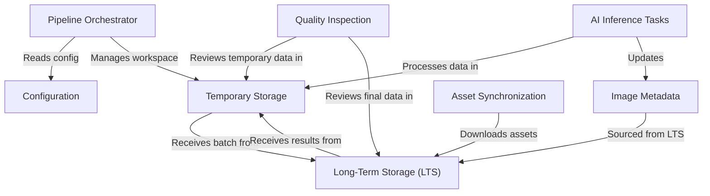

# Tutorial: Field-AnnotationPipeline

The Field-AnnotationPipeline is a system that **processes batches** of agricultural images.
It uses a *central orchestrator* to follow a defined plan, *reading configuration* to determine the steps.
Images and data are *synchronized* from and *stored long-term* in a central location (LTS),
but all processing happens in a *temporary local workspace*.
The pipeline *applies AI models* to detect, classify, and segment plants, *updating detailed metadata* for each image.
Finally, it includes *quality inspection* steps to review the results before they are moved back to *long-term storage*.

**Source Repository:** [None](None)

## Chapters

1. [Long-Term Storage (LTS)
](01_long_term_storage__lts__.md)
2. [Image Metadata
](02_image_metadata_.md)
3. [Configuration
](03_configuration_.md)
4. [Pipeline Orchestrator
](04_pipeline_orchestrator_.md)
5. [Temporary Storage
](05_temporary_storage_.md)
6. [Asset Synchronization
](06_asset_synchronization_.md)
7. [AI Inference Tasks
](07_ai_inference_tasks_.md)
8. [Quality Inspection
](08_quality_inspection_.md)

---

Generated by [AI Codebase Knowledge Builder](https://github.com/The-Pocket/Tutorial-Codebase-Knowledge)